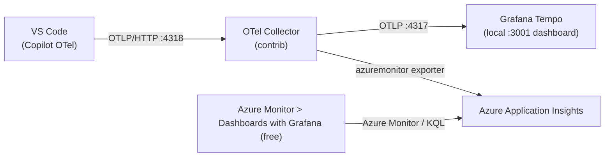
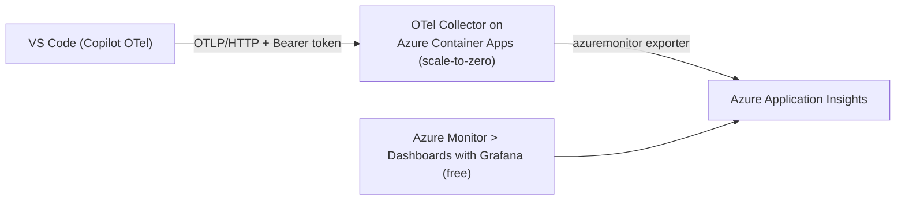
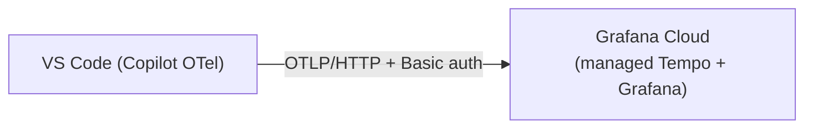

# Visualize GitHub Copilot Prompt Caching with OpenTelemetry + Grafana

See, per developer and per prompt shape, how often GitHub Copilot **reads from the prompt cache**
(a cache *hit* -> faster, cheaper, more stable) versus **rebuilds it** (a cache *miss*). Recent
VS Code versions emit OpenTelemetry traces for Copilot Chat using the GenAI semantic conventions;
this repo turns those traces into dashboards.


## Four ways to run it

Pick what fits. **A and B** run a collector/Tempo on your machine. **C and D** run **nothing
locally** - VS Code points its OTLP endpoint straight at the cloud.

| Option | Runs locally | Backend | View dashboards in | Cost |
|--------|--------------|---------|--------------------|------|
| **A - Local** | Docker: Tempo + Grafana | Grafana Tempo | Local Grafana `http://localhost:3001` (TraceQL) | $0 |
| **B - Azure, local collector** | Docker: Collector + Tempo + Grafana | Application Insights (+ local Tempo) | Azure Monitor -> **Dashboards with Grafana** | ~$0 |
| **C - Azure Container Apps** | Nothing | Application Insights | Azure Monitor -> **Dashboards with Grafana** | ~$0 (scale-to-zero) |
| **D - Grafana Cloud** | Nothing | Grafana Cloud (managed Tempo) | Grafana Cloud | $0 (free tier) |

> **None of these need a paid Grafana instance.** B and C view the official **GitHub Copilot**
> dashboard for free *inside the Azure portal* via
> [Azure Monitor dashboards with Grafana](https://learn.microsoft.com/en-us/azure/azure-monitor/visualize/visualize-use-grafana-dashboards)
> (same Grafana engine, $0 - versus ~$68/mo for Azure Managed Grafana). D uses Grafana Cloud's free tier.

See [Choosing an option](#choosing-an-option-detailed-trade-offs) below for a full comparison.

---

## Choosing an option (detailed trade-offs)

### Comparison matrix

| Dimension | A - Local | B - Azure, local collector | C - ACA collector | D - Grafana Cloud |
|-----------|-----------|----------------------------|-------------------|-------------------|
| **Runs on your machine** | Docker: Tempo + Grafana | Docker: Collector + Tempo + Grafana | Nothing | Nothing |
| **Managed in the cloud** | none | Application Insights | ACA collector + Application Insights | Grafana Cloud (everything) |
| **Telemetry backend** | Grafana Tempo (local) | Tempo (local) + App Insights | Application Insights | Grafana Cloud Tempo |
| **Query language** | TraceQL | TraceQL **and** KQL | KQL | TraceQL |
| **Dashboard** | this repo's TraceQL | this repo's TraceQL + official **GitHub Copilot** | official **GitHub Copilot** | this repo's TraceQL (re-point data source) |
| **Collector in path** (redaction / fan-out / buffering) | No | **Yes** (local) | **Yes** (cloud) | No (direct) |
| **Auth on the wire** | none (localhost) | none (localhost) | Bearer token (public endpoint) | Basic (instance ID + token) |
| **Where data lives** | your laptop only | laptop + your Azure region | your Azure region | Grafana Labs SaaS region |
| **Cost** | $0 | ~$0 (App Insights 5 GB/mo free, then per-GB) | ~$0 (ACA free grant + scale-to-zero; App Insights 5 GB/mo free) | $0 free tier |
| **Free-tier caps** | n/a | App Insights: 5 GB/mo, 90-day retention | ACA: 180k vCPU-s + 360k GiB-s + 2M req/mo; App Insights 5 GB/mo, 90-day | 50 GB traces/mo, **14-day** retention, **3 users** |
| **Setup effort** | lowest (`docker compose up`) | medium (compose + `setup-azure.ps1`) | medium (`setup-azure.ps1` + `deploy-collector-aca.ps1`) | low (sign up + 3 env vars) |
| **Cold start** | no | no | **yes** (first request after idle) | no |
| **Works offline / no cloud account** | **Yes** | No | No | No |
| **Team / fleet ready** | No (per machine) | No (per machine) | **Yes** (shared endpoint) | **Yes** (shared endpoint) |

### Cross-cutting trade-offs

- **Collector vs. direct.** B and C put an OTel Collector in the path, which buys you three things
  the direct paths lack: (1) **redaction/filtering** of attributes before they leave; (2) **fan-out**
  to more than one backend (B already sends to Tempo *and* App Insights); (3) **batching, retry, and
  buffering** so a brief backend outage doesn't drop spans. D (direct to Grafana Cloud) is the
  simplest wiring but has none of these - if the endpoint is unreachable, spans are dropped, and
  whatever the editor emits goes straight to the SaaS.
- **TraceQL vs. KQL.** A, D, and the local view of B use Grafana Tempo and **TraceQL** (this repo's
  cache dashboard). B's Azure view and C use App Insights and **KQL** (the official *GitHub Copilot*
  dashboard). B is the only option that gives you both at once.
- **Data residency & compliance.** A keeps data on the laptop. B and C keep the cloud copy in **your
  Azure region** (e.g. Sweden Central / Norway East) under your Azure RBAC - the better fit when
  telemetry must stay in Azure/EEA. D sends data to **Grafana Labs' SaaS**, a third party, which may
  matter for regulated workloads.
- **Single developer vs. fleet.** A and B run per-machine (every dev runs Docker), so they're great
  for one person or a proof-of-concept but don't aggregate a team. To cover a fleet you need a
  **shared endpoint** - exactly C (your cloud collector) or D (Grafana Cloud SaaS) - rolled out with
  **Intune** environment variables (`OTEL_EXPORTER_OTLP_ENDPOINT` + `OTEL_EXPORTER_OTLP_HEADERS`).
- **Security.** C and D send auth over the wire; C's endpoint is **public**, so treat the bearer
  token as a secret and, for production, add IP restrictions or Private Link. Keep `captureContent`
  **off** - it matters most for C/D, where content would land in a shared/third-party backend with
  no collector to scrub it.
- **Reliability & latency.** Local paths (A/B) have the lowest latency and no cold start. C scales to
  zero, so the first request after idle waits a few seconds while a replica spins up (subsequent
  requests are fast; the SDK batches and retries). C/D depend on network egress to the cloud.
- **Cost, concretely.** All four avoid the ~$68/mo of Azure Managed Grafana. A is truly $0. B and C
  ride Application Insights' 5 GB/month free grant (a demo ingests far less); C adds an ACA app that
  bills only while a replica runs and is covered by ACA's monthly free grant. D is free until you hit
  50 GB traces/month, 14-day retention, or 3 users - after which Grafana Cloud Pro applies.

### When to pick each

- **A - Local.** Solo developer, a quick local check, offline/air-gapped, or no cloud account. Zero
  setup, fully private. Downside: one machine only, data is ephemeral, no org-wide view.
- **B - Azure, local collector.** You want *both* the local TraceQL cache dashboard and the official
  Azure GitHub Copilot dashboard, with a collector for redaction/fan-out, and data in your Azure
  tenant - a great single-machine evaluation before a fleet rollout. Downside: still runs Docker locally.
- **C - Azure Container Apps collector.** An Azure org that wants a **fleet-ready, nothing-local**
  setup with data staying in Azure, the official dashboard, a collector in the path, and ~$0 idle
  cost (scale-to-zero). Downside: you operate a public endpoint + token, and there's a cold start.
- **D - Grafana Cloud.** A Grafana-Cloud shop or small team that wants **nothing to run** and the
  fastest path to a hosted dashboard. Downside: third-party data residency and free-tier caps
  (50 GB / 14 days / 3 users), no collector in the path.

---

## How prompt-cache visibility works

Copilot Chat spans carry these attributes (OTel [GenAI semantic conventions](https://github.com/open-telemetry/semantic-conventions/blob/main/docs/gen-ai/)):

| Attribute | Meaning |
|-----------|---------|
| `gen_ai.usage.input_tokens` / `gen_ai.usage.output_tokens` | Raw token counts |
| `gen_ai.usage.cache_read.input_tokens` | Tokens served **from** cache -> **cache HIT** |
| `gen_ai.usage.cache_creation.input_tokens` | Tokens **written to** cache -> **cache MISS** (new entry) |
| `gen_ai.request.model` | Model (slice dashboards by model) |
| `gen_ai.operation.name` | `chat`, `invoke_agent`, or `execute_tool` |

**Cache hit** = `cache_read.input_tokens > 0` &nbsp;.&nbsp; **Cache miss** = `cache_creation.input_tokens > 0` &nbsp;.&nbsp; **No cache** = both 0.

Unstable prompt prefixes (a drifting system message, unstable tool ordering, a workspace hint that
changes every call) quietly destroy your hit rate. These dashboards make that visible.

---

## Configure VS Code

Copilot emits OTel when `github.copilot.chat.otel.enabled` is `true` (or the `OTEL_EXPORTER_OTLP_ENDPOINT`
env var is set). All signals follow the GenAI conventions, so they work with any OTel backend.

### Local options (A, B) - `settings.json`

Add these to your **User** `settings.json` (`Ctrl+Shift+P` -> *Open User Settings (JSON)*), then
reload the window (`Ctrl+Shift+P` -> *Developer: Reload Window*):

```json
{
  "github.copilot.chat.otel.enabled": true,
  "github.copilot.chat.otel.exporterType": "otlp-http",
  "github.copilot.chat.otel.otlpEndpoint": "http://localhost:4318",
  "github.copilot.chat.otel.captureContent": false
}
```

`http://localhost:4318` is Tempo directly (A) or the local collector (B). In both cases VS Code's
settings are identical.

### Cloud options (C, D) - environment variables

Cloud endpoints require an **auth token**, and the Copilot client reads the token from an
environment variable (there is **no `settings.json` key for headers**). Set these instead
(no `settings.json` changes needed), then **restart VS Code**:

```powershell
setx OTEL_EXPORTER_OTLP_ENDPOINT "https://<your-cloud-endpoint>"
setx OTEL_EXPORTER_OTLP_HEADERS  "Authorization=Bearer <token>"   # Grafana Cloud uses "Basic <base64>"
setx COPILOT_OTEL_ENABLED        "true"
```

> **Important safety notes**
> - Use **User** settings / user env vars, not Workspace - the OTel SDK initializes early in startup.
> - `captureContent` stays `false` by default. Setting it to `true` puts full prompts and responses
>   in the traces - great for debugging your own, risky for anyone else's.
> - Going direct to the cloud (C, D) means no collector in the path to redact/filter content, so
>   keep content capture off and treat the endpoint token as a secret.

---

## Option A - Local (Docker, no cloud)

```
VS Code (Copilot OTel) --OTLP/HTTP :4318--> Grafana Tempo --TraceQL :3200--> Grafana :3001
```

### 1. Start the stack

```bash
docker compose up -d
```

| Service | Host port | Purpose |
|---------|-----------|---------|
| Tempo   | 4318 / 4317 | OTLP receiver (HTTP / gRPC) |
| Tempo   | 3200 | Tempo query API |
| Grafana | **3001** | Dashboards - login `admin` / `admin` |

> **Port note:** upstream uses `3000` for Grafana; it's remapped to **3001** here because `3000`
> was already taken on the author's machine. The container still listens on 3000 internally.

### 2. Configure VS Code

Apply the [local settings](#local-options-a-b---settingsjson) above and reload.

### 3. Generate traces

Use Copilot Chat (ask questions, run agent tasks, invoke tools). Each interaction produces a tree:

```
invoke_agent copilot
  |-- chat gpt-4o          <- cache_read / cache_creation tokens live here
  |-- execute_tool readFile
  |-- chat gpt-4o
```

### 4. View the dashboard

Open **http://localhost:3001** -> Dashboards -> **Copilot Prompt Cache & Usage**. Panels include
cache hit vs miss over time, per-model calls and latency, top tools, and a raw span table.

### 5. Explore raw traces (Explore -> Tempo)

```traceql
{ span.gen_ai.usage.cache_read.input_tokens > 0 }
```
```traceql
{ span.gen_ai.operation.name = "chat" && resource.service.name = "copilot-chat" }
```

### Stop

```bash
docker compose down -v
```

---

## Option B - Azure, local collector (free visualization)

An **OpenTelemetry Collector** runs locally and **fans out** to *both* Grafana Tempo (local TraceQL
dashboard) **and** Azure Application Insights. You then view the official **GitHub Copilot**
dashboard for free in the Azure portal - no paid Grafana instance.



### 1. Provision the Azure backend (Log Analytics + Application Insights)

```powershell
az login
./azure/setup-azure.ps1 -Location swedencentral -ResourceGroup rg-ghcp-otel -NamePrefix ghcpotel
```

Idempotent. It creates a workspace-based Application Insights, grants your user read access, and
writes the connection string to `.env` (git-ignored). **No Managed Grafana is created.**

### 2. Switch to the collector-fronted stack

The Azure stack reuses the same host ports, so stop the local-only one first:

```powershell
docker compose -f docker-compose.yml down
docker compose -f docker-compose.azure.yml up -d
```

### 3. Configure VS Code

Apply the [local settings](#local-options-a-b---settingsjson) - `:4318` now points at the collector.

### 4. Verify data reached Application Insights

```powershell
$id = az monitor app-insights component show -g rg-ghcp-otel -a ghcpotel-appi --query id -o tsv
az monitor app-insights query --ids $id --analytics-query `
  "dependencies | where timestamp > ago(1h) | where cloud_RoleName == 'copilot-chat' | take 50"
```

The `azuremonitor` exporter maps Copilot spans into the App Insights **`dependencies`** table with
`cloud_RoleName == "copilot-chat"` and all `gen_ai.*` values in `customDimensions` - exactly the
schema the official dashboard queries.

### 5. View the dashboard - free, in the Azure portal

1. Azure portal -> **Azure Monitor** -> **Dashboards with Grafana**.
2. Open the **GitHub Copilot** dashboard from the gallery (or browse to
   <https://aka.ms/amg/dash/gh-copilot>, which opens this same in-portal gallery).
   If it isn't listed, use **New -> Import** and paste the dashboard's JSON / Grafana ID.
3. When prompted, pick the **Azure Monitor** data source and scope it to `rg-ghcp-otel`.

### 6. Tear down

```powershell
./azure/teardown-azure.ps1 -ResourceGroup rg-ghcp-otel
```

---

## Option C - Azure Container Apps collector (nothing runs locally, scale-to-zero)

Run the OTel Collector in the cloud on **Azure Container Apps** (Consumption plan, `minReplicas: 0`),
exposing a public, token-protected OTLP endpoint that forwards to Application Insights. Nothing runs
on your machine; the endpoint costs ~$0 while idle (scales to zero) and wakes on the first request.



### 1. Provision App Insights (if you haven't)

```powershell
az login
./azure/setup-azure.ps1 -ResourceGroup rg-ghcp-otel -NamePrefix ghcpotel
```

### 2. Deploy the collector to Azure Container Apps

```powershell
./azure/deploy-collector-aca.ps1 -ResourceGroup rg-ghcp-otel -NamePrefix ghcpotel
```

This creates a Consumption Container Apps environment and a scale-to-zero app, generates a random
64-hex bearer token, wires the collector config (`config/otel-collector-cloud.yaml`) + the App
Insights connection string as secrets, and writes the endpoint + token + ready-to-paste env vars to
`.env.aca` (git-ignored). It prints:

```
OTLP endpoint : https://<app>.<region>.azurecontainerapps.io
Bearer token  : <64-hex>
```

### 3. Point VS Code at it (values from `.env.aca`)

```powershell
setx OTEL_EXPORTER_OTLP_ENDPOINT "https://<app>.<region>.azurecontainerapps.io"
setx OTEL_EXPORTER_OTLP_HEADERS  "Authorization=Bearer <token>"
setx COPILOT_OTEL_ENABLED        "true"
```

Restart VS Code and use Copilot Chat. (Header auth is env-var only - there is no `settings.json` key.)

### 4. Verify + view

Same as Option B steps 4-5: query App Insights `dependencies | where cloud_RoleName == 'copilot-chat'`,
then open **Azure Monitor -> Dashboards with Grafana -> GitHub Copilot**.

### 5. Stop / tear down

Delete just the collector (keep App Insights):

```powershell
az containerapp delete     -g rg-ghcp-otel -n ghcpotel-collector --yes
az containerapp env delete -g rg-ghcp-otel -n ghcpotel-acaenv     --yes
```

Or remove everything: `./azure/teardown-azure.ps1 -ResourceGroup rg-ghcp-otel`.

> **Cost:** Consumption + `minReplicas: 0` means no always-running instance; ACA's monthly free
> grant typically covers demo traffic. The first request after idle incurs a few-second cold start.

---

## Option D - Grafana Cloud (nothing runs locally, $0)

Point VS Code straight at Grafana Cloud's managed OTLP endpoint. No Docker, no collector, no Azure -
traces go to Grafana Cloud's managed Tempo and you use TraceQL there.



### 1. Create a free Grafana Cloud stack

Sign up at [grafana.com](https://grafana.com/) (free tier). In your stack, open the
**OpenTelemetry (OTLP)** connection page and note:

- the **OTLP endpoint**, e.g. `https://otlp-gateway-<zone>.grafana.net/otlp`
- your **Instance ID** (a number) and an **API token** (with OTLP / MetricsPublisher scope).

### 2. Set VS Code environment variables

Grafana Cloud uses HTTP Basic auth - the header value is `Basic base64("<instanceID>:<token>")`:

```powershell
$b64 = [Convert]::ToBase64String([Text.Encoding]::UTF8.GetBytes("<instanceID>:<token>"))
setx OTEL_EXPORTER_OTLP_ENDPOINT "https://otlp-gateway-<zone>.grafana.net/otlp"
setx OTEL_EXPORTER_OTLP_HEADERS  "Authorization=Basic $b64"
setx COPILOT_OTEL_ENABLED        "true"
```

Restart VS Code, then use Copilot Chat.

### 3. View

In Grafana Cloud, open **Explore -> your Traces (Tempo) data source** and run the same TraceQL, e.g.
`{ span.gen_ai.usage.cache_read.input_tokens > 0 }`. To reuse the prebuilt dashboard, import
`dashboards/copilot-prompt-cache.json` and re-point its data source to your Grafana Cloud Tempo.

---

## Repository layout

| Path | Purpose |
|------|---------|
| `docker-compose.yml` | **Option A** - Tempo + Grafana |
| `docker-compose.azure.yml` | **Option B** - OTel Collector + Tempo + Grafana |
| `config/tempo.yaml` | Tempo: OTLP receivers, local storage, TraceQL-metrics generator |
| `config/grafana/*.yaml` | Grafana provisioning (Tempo data source + dashboard) |
| `config/otel-collector.yaml` | **Option B** collector: OTLP in -> `otlp/tempo` + `azuremonitor` |
| `config/otel-collector-cloud.yaml` | **Option C** collector: OTLP + bearer auth -> `azuremonitor` |
| `dashboards/copilot-prompt-cache.json` | The local TraceQL cache/usage dashboard |
| `azure/setup-azure.ps1` | Provisions Log Analytics + Application Insights, writes `.env` |
| `azure/deploy-collector-aca.ps1` | **Option C** - deploy the collector to Azure Container Apps |
| `azure/teardown-azure.ps1` | Deletes the resource group |
| `.env.example` | Template for `APPLICATIONINSIGHTS_CONNECTION_STRING` (copy to `.env`) |

## Rolling this out to a team (Intune)

For one machine the settings above are fine, but to guarantee every developer reports telemetry,
push the config as **managed settings via Microsoft Intune** so it isn't opt-in:

- **Local collector (B):** push the four `github.copilot.chat.otel.*` settings.
- **Cloud endpoint (C, D):** push the `OTEL_EXPORTER_OTLP_ENDPOINT` and `OTEL_EXPORTER_OTLP_HEADERS`
  environment variables (and `COPILOT_OTEL_ENABLED=true`) to managed devices, pointing at your shared
  collector or SaaS endpoint. This is the most scalable shape - developers run nothing locally.

## Credits

- Original concept, local Docker stack, and dashboard by **Samuel Tauil** -
  [samueltauil/copilot-traces](https://github.com/samueltauil/copilot-traces) and the article
  [Visualizing Copilot Prompt Cache with OTel + Grafana](https://samueltauil.github.io/github-copilot/devops/2026/07/02/visualizing-copilot-prompt-cache-otel-grafana.html).
- This fork adds the free **Azure Monitor "Dashboards with Grafana"** variant (Option B), an
  **Azure Container Apps** scale-to-zero collector (Option C), and a **Grafana Cloud** direct path
  (Option D) - none requiring a paid Grafana instance.
- Licensed under [MIT](LICENSE).

## References

- [Monitor agent usage with OpenTelemetry (VS Code docs)](https://code.visualstudio.com/docs/agents/guides/monitoring-agents)
- [Monitor AI coding agents with Grafana (Microsoft Learn)](https://learn.microsoft.com/en-us/azure/managed-grafana/grafana-opentelemetry-app-insights)
- [Azure Monitor dashboards with Grafana](https://learn.microsoft.com/en-us/azure/azure-monitor/visualize/visualize-use-grafana-dashboards)
- [Grafana Cloud OTLP endpoint](https://grafana.com/docs/grafana-cloud/send-data/otlp/)
- [Azure Monitor Exporter (OpenTelemetry Collector contrib)](https://github.com/open-telemetry/opentelemetry-collector-contrib/tree/main/exporter/azuremonitorexporter)
