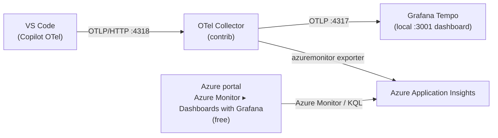

# Visualize GitHub Copilot Prompt Caching with OpenTelemetry + Grafana

See, per developer and per prompt shape, how often GitHub Copilot **reads from the prompt cache**
(a cache *hit* → faster, cheaper, more stable) versus **rebuilds it** (a cache *miss*). Recent
VS Code versions emit OpenTelemetry traces for Copilot Chat using the GenAI semantic conventions;
this repo turns those traces into dashboards.


Two ways to run it — pick one (or do both):

| | **Option A — Local** | **Option B — Azure (free visualization)** |
|---|---|---|
| Backend | Grafana Tempo (Docker) | Application Insights |
| Dashboard | Local Grafana (Docker) at `:3001`, TraceQL | Official **GitHub Copilot** dashboard in the Azure portal |
| Where you view it | `http://localhost:3001` | Azure Monitor → **Dashboards with Grafana** |
| Cost | $0 | ~$0 (App Insights per‑GB only; **no paid Grafana instance**) |
| Needs a cloud account | No | Yes |

> **Why Option B is free:** instead of running paid **Azure Managed Grafana** (~$68/mo), you view
> the exact same Grafana‑powered dashboards *inside the Azure portal* via
> [Azure Monitor dashboards with Grafana](https://learn.microsoft.com/en-us/azure/azure-monitor/visualize/visualize-use-grafana-dashboards),
> which is free for Azure portal use. Same rendering engine, same panels — no standalone instance to pay for.

---

## How prompt‑cache visibility works

Copilot Chat spans carry these attributes (OTel [GenAI semantic conventions](https://github.com/open-telemetry/semantic-conventions/blob/main/docs/gen-ai/)):

| Attribute | Meaning |
|-----------|---------|
| `gen_ai.usage.input_tokens` / `gen_ai.usage.output_tokens` | Raw token counts |
| `gen_ai.usage.cache_read.input_tokens` | Tokens served **from** cache → **cache HIT** |
| `gen_ai.usage.cache_creation.input_tokens` | Tokens **written to** cache → **cache MISS** (new entry) |
| `gen_ai.request.model` | Model (slice dashboards by model) |
| `gen_ai.operation.name` | `chat`, `invoke_agent`, or `execute_tool` |

**Cache hit** = `cache_read.input_tokens > 0`  ·  **Cache miss** = `cache_creation.input_tokens > 0`  ·  **No cache** = both 0.

Unstable prompt prefixes (a drifting system message, unstable tool ordering, a workspace hint that
changes every call) quietly destroy your hit rate. These dashboards make that visible.

---

## VS Code settings (required for both options)

Add these to your **User** `settings.json` (`Ctrl+Shift+P` → *Open User Settings (JSON)*), then
reload the window (`Ctrl+Shift+P` → *Developer: Reload Window*):

```json
{
  "github.copilot.chat.otel.enabled": true,
  "github.copilot.chat.otel.exporterType": "otlp-http",
  "github.copilot.chat.otel.otlpEndpoint": "http://localhost:4318",
  "github.copilot.chat.otel.captureContent": false
}
```

> **Must be User settings, not Workspace.** The OTel SDK initializes early in VS Code startup, and
> workspace settings load too late for the exporter to pick them up.
>
> `captureContent` is `false` by default (safe). Setting it to `true` includes full prompts and
> responses in the traces — great for debugging your own prompts, risky for anyone else's.

`http://localhost:4318` is the OTLP endpoint for **both** options: in Option A it's Tempo directly;
in Option B it's the OTel Collector (which then fans out). Your VS Code settings never change.

---

## Option A — Local (Docker, no cloud)

```
VS Code (Copilot OTel) --OTLP/HTTP :4318--> Grafana Tempo --TraceQL :3200--> Grafana :3001
```

### 1. Start the stack

```bash
docker compose up -d
```

| Service | Host port | Purpose |
|---------|-----------|---------|
| Tempo   | 4318 / 4317 | OTLP receiver (HTTP / gRPC) |
| Tempo   | 3200 | Tempo query API |
| Grafana | **3001** | Dashboards — login `admin` / `admin` |

> **Port note:** upstream uses `3000` for Grafana; it's remapped to **3001** here because `3000`
> was already taken on the author's machine. The container still listens on 3000 internally.

### 2. Configure VS Code

Apply the [VS Code settings](#vs-code-settings-required-for-both-options) above and reload.

### 3. Generate traces

Use Copilot Chat (ask questions, run agent tasks, invoke tools). Each interaction produces a tree:

```
invoke_agent copilot
  ├── chat gpt-4o          ← cache_read / cache_creation tokens live here
  ├── execute_tool readFile
  └── chat gpt-4o
```

### 4. View the dashboard

Open **http://localhost:3001** → Dashboards → **Copilot Prompt Cache & Usage**. Panels include
cache hit vs miss over time, per‑model calls and latency, top tools, and a raw span table.

### 5. Explore raw traces (Explore → Tempo)

```traceql
{ span.gen_ai.usage.cache_read.input_tokens > 0 }
```
```traceql
{ span.gen_ai.operation.name = "chat" && resource.service.name = "copilot-chat" }
```

### Stop

```bash
docker compose down -v
```

---

## Option B — Azure, free visualization

Same idea, but an **OpenTelemetry Collector** terminates OTLP and **fans out** to *both* local
Grafana Tempo **and** Azure Application Insights. You then view the official **GitHub Copilot**
dashboard for free in the Azure portal — no paid Grafana instance.



You get the local TraceQL cache dashboard **and** the org‑wide Azure dashboard from one pipeline.

### 1. Provision the Azure backend (Log Analytics + Application Insights)

```powershell
az login
./azure/setup-azure.ps1 -Location swedencentral -ResourceGroup rg-ghcp-otel -NamePrefix ghcpotel
```

Idempotent. It creates a workspace‑based Application Insights, grants your user read access, and
writes the connection string to `.env` (git‑ignored). **No Managed Grafana is created.**

### 2. Switch to the collector‑fronted stack

The Azure stack reuses the same host ports, so stop the local‑only one first:

```powershell
docker compose -f docker-compose.yml down
docker compose -f docker-compose.azure.yml up -d
```

### 3. Configure VS Code

Same [settings](#vs-code-settings-required-for-both-options) — `:4318` now points at the collector.

### 4. Verify data reached Application Insights

```powershell
$id = az monitor app-insights component show -g rg-ghcp-otel -a ghcpotel-appi --query id -o tsv
az monitor app-insights query --ids $id --analytics-query `
  "dependencies | where timestamp > ago(1h) | where cloud_RoleName == 'copilot-chat' | take 50"
```

The `azuremonitor` exporter maps Copilot spans into the App Insights **`dependencies`** table with
`cloud_RoleName == "copilot-chat"` and all `gen_ai.*` values in `customDimensions` — exactly the
schema the official dashboard queries.

### 5. View the dashboard — free, in the Azure portal

1. Azure portal → **Azure Monitor** → **Dashboards with Grafana**.
2. Open the **GitHub Copilot** dashboard from the gallery (or browse to
   <https://aka.ms/amg/dash/gh-copilot>, which opens this same in‑portal gallery).
   If it isn't listed, use **New → Import** and paste the dashboard's JSON / Grafana ID.
3. When prompted, pick the **Azure Monitor** data source and scope it to `rg-ghcp-otel`.

It shows operations, input/output tokens, chat sessions, tool calls, and per‑model latency/TTFT —
the enterprise counterpart to the local TraceQL cache dashboard.

### 6. Tear down (stop all Azure cost)

```powershell
./azure/teardown-azure.ps1 -ResourceGroup rg-ghcp-otel
```

> **Cost:** App Insights + Log Analytics bill per GB ingested (negligible for a demo) and have no
> hourly instance fee. Run the teardown script when you're completely done.

---

## Repository layout

| Path | Purpose |
|------|---------|
| `docker-compose.yml` | **Option A** — Tempo + Grafana |
| `docker-compose.azure.yml` | **Option B** — OTel Collector + Tempo + Grafana |
| `config/tempo.yaml` | Tempo: OTLP receivers, local storage, TraceQL‑metrics generator |
| `config/grafana/*.yaml` | Grafana provisioning (Tempo data source + dashboard) |
| `config/otel-collector.yaml` | Collector: OTLP in → `otlp/tempo` + `azuremonitor` exporters |
| `dashboards/copilot-prompt-cache.json` | The local TraceQL cache/usage dashboard |
| `azure/setup-azure.ps1` | Provisions Log Analytics + Application Insights, writes `.env` |
| `azure/teardown-azure.ps1` | Deletes the resource group |
| `.env.example` | Template for `APPLICATIONINSIGHTS_CONNECTION_STRING` (copy to `.env`) |

## Rolling this out to a team (Intune)

The four VS Code settings are fine for one machine, but to guarantee every developer reports
telemetry, push them as **managed settings via Microsoft Intune** so it isn't opt‑in. Point the
managed `github.copilot.chat.otel.otlpEndpoint` at a shared/remote collector instead of `localhost`.

## Credits

- Original concept, local Docker stack, and dashboard by **Samuel Tauil** —
  [samueltauil/copilot-traces](https://github.com/samueltauil/copilot-traces) and the article
  [Visualizing Copilot Prompt Cache with OTel + Grafana](https://samueltauil.github.io/github-copilot/devops/2026/07/02/visualizing-copilot-prompt-cache-otel-grafana.html).
- This fork adds the **free Azure Monitor "Dashboards with Grafana"** variant (OTel Collector fan‑out
  to Application Insights, no paid Grafana instance).
- Licensed under [MIT](LICENSE).

## References

- [Monitor AI coding agents with Grafana (Microsoft Learn)](https://learn.microsoft.com/en-us/azure/managed-grafana/grafana-opentelemetry-app-insights)
- [Azure Monitor dashboards with Grafana](https://learn.microsoft.com/en-us/azure/azure-monitor/visualize/visualize-use-grafana-dashboards)
- [Monitor agent usage with OpenTelemetry (VS Code docs)](https://code.visualstudio.com/docs/copilot/guides/monitoring-agents)
- [Azure Monitor Exporter (OpenTelemetry Collector contrib)](https://github.com/open-telemetry/opentelemetry-collector-contrib/tree/main/exporter/azuremonitorexporter)
