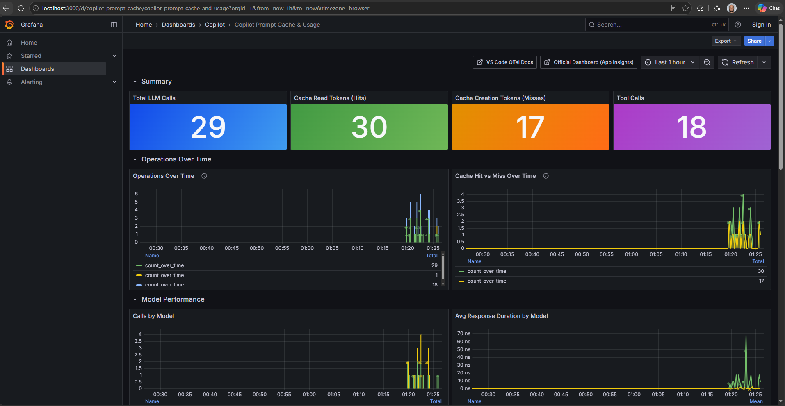
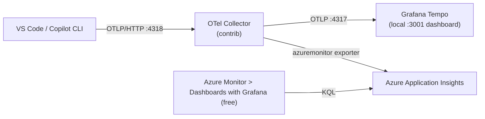
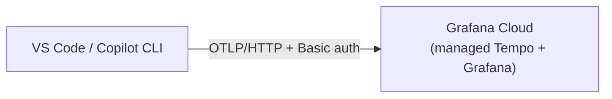

# OpenTelemetry for GitHub Copilot — VS Code + the CLI

A hands-on experiment and reference implementation for wiring **OpenTelemetry** through the GitHub
Copilot surfaces that **actually emit customer-collectable OTel today** — **VS Code Copilot Chat** and
the **GitHub Copilot CLI** — and visualizing the result in Grafana. (Other surfaces don't expose it
yet; the coverage table below is the honest map.) It's built to be the working foundation for a
longread article: each backend is a self-contained, reproducible setup, and the dashboards let you
compare VS Code vs the CLI (or look at both together).

The running theme is **prompt-cache efficiency** — how often Copilot reads from the prompt cache
(a *hit*: faster, cheaper, more stable) versus rebuilds it (a *miss*) — plus token usage, model mix,
tool calls, and latency. All of it comes from the OTel [GenAI semantic conventions](https://github.com/open-telemetry/semantic-conventions/blob/main/docs/gen-ai/),
so the same queries work for both surfaces and any OTel-compatible backend.



---

## The two axes: surfaces × backends

This repo is organized around two independent choices.

### 1. Surfaces — *what* emits OpenTelemetry

Only some Copilot surfaces expose OTel you can export to your own backend today. The honest map
(mid-2026):

| Surface | Export OTel to your backend? | `resource.service.name` | How |
|---------|------------------------------|-------------------------|-----|
| **VS Code Copilot Chat** | ✅ Yes | `copilot-chat` | `github.copilot.chat.otel.*` settings or `OTEL_*` env vars |
| **GitHub Copilot CLI** | ✅ Yes | `github-copilot` | `OTEL_*` env vars (`COPILOT_OTEL_ENABLED=true`) |
| **Copilot SDK** (Node/Py/Go/.NET/Java/Rust) | ✅ Yes — for apps you build | configurable | `TelemetryConfig` (drives the CLI process) |
| **Visual Studio** extension | ❌ Not today | — | — |
| **JetBrains** plugins | ❌ Not today | — | Rider's own OTel plugin instruments *your app*, not Copilot |
| **Copilot app** (desktop) | ✅ Yes — via the CLI | `github-copilot` | Frontend to the Copilot CLI: the same `OTEL_*` env vars enable it and it reports as `github-copilot` (verified) |
| **Cloud coding agent** (opens PRs) | ❌ Not directly | — | server-side; the *client* only emits session counters |

So this repo is scoped to the two OTel identities you can actually collect from — **VS Code (`copilot-chat`)**
and **the CLI (`github-copilot`)**. The desktop **Copilot app** is a frontend to the CLI, so it emits the
same telemetry and reports as `github-copilot` too — it rides the `Copilot CLI` selector option rather than
adding a new one. Both follow the **same GenAI conventions** (identical `gen_ai.*`
attributes), differing only in `resource.service.name` — which is exactly what the dashboards use as a
**surface selector** (`All (VS Code + CLI)` / `VS Code` / `Copilot CLI`). Keep `OTEL_SERVICE_NAME`
**unset** so each surface keeps its distinct default name. When another surface adopts these
conventions, it slots in: a new `service.name`, a new option in the selector.

### 2. Backends — *where* the telemetry goes

| Option | Runs locally | Backend | View dashboards in | Cost |
|--------|--------------|---------|--------------------|------|
| **A - Local** | Docker: Tempo + Grafana | Grafana Tempo | Local Grafana `http://localhost:3001` (TraceQL) | $0 |
| **B - Azure, local collector** | Docker: Collector + Tempo + Grafana | Application Insights (+ local Tempo) | Local Grafana **and** Azure Monitor → Dashboards with Grafana | ~$0 |
| **C - Azure Container Apps** | Nothing | Application Insights | Azure Monitor → Dashboards with Grafana | ~$0 (scale-to-zero) |
| **D - Grafana Cloud** | Nothing | Grafana Cloud (managed Tempo) | Grafana Cloud | $0 (free tier) |

> **None of these need a paid Grafana instance.** B and C view dashboards for free *inside the Azure
> portal* via [Azure Monitor dashboards with Grafana](https://learn.microsoft.com/en-us/azure/azure-monitor/visualize/visualize-use-grafana-dashboards)
> (same Grafana engine, $0 — versus ~$68/mo for Azure Managed Grafana). D uses Grafana Cloud's free tier.

Every backend carries **both surfaces** — the surface selector works everywhere. See
[Choosing a backend](#choosing-a-backend-detailed-trade-offs) for a full comparison.

---

## Choosing a backend (detailed trade-offs)

### Comparison matrix

| Dimension | A - Local | B - Azure, local collector | C - ACA collector | D - Grafana Cloud |
|-----------|-----------|----------------------------|-------------------|-------------------|
| **Runs on your machine** | Docker: Tempo + Grafana | Docker: Collector + Tempo + Grafana | Nothing | Nothing |
| **Managed in the cloud** | none | Application Insights | ACA collector + Application Insights | Grafana Cloud (everything) |
| **Telemetry backend** | Grafana Tempo (local) | Tempo (local) + App Insights | Application Insights | Grafana Cloud Tempo |
| **Query language** | TraceQL | TraceQL **and** KQL | KQL | TraceQL |
| **Surfaces covered** | both (selector) | both (selector) | both (selector) | both (selector) |
| **Collector in path** (redaction / fan-out / buffering) | No | **Yes** (local) | **Yes** (cloud) | No (direct) |
| **Auth on the wire** | none (localhost) | none (localhost) | Bearer token (public endpoint) | Basic (instance ID + token) |
| **Where data lives** | your laptop only | laptop + your Azure region | your Azure region | Grafana Labs SaaS region |
| **Cost** | $0 | ~$0 (App Insights 5 GB/mo free) | ~$0 (ACA free grant + scale-to-zero) | $0 free tier |
| **Free-tier caps** | n/a | App Insights: 5 GB/mo, 90-day | ACA: 180k vCPU-s + 2M req/mo; App Insights 5 GB/mo | 50 GB traces/mo, 14-day, 3 users |
| **Cold start** | no | no | **yes** (first request after idle) | no |
| **Works offline / no cloud account** | **Yes** | No | No | No |
| **Team / fleet ready** | No (per machine) | No (per machine) | **Yes** (shared endpoint) | **Yes** (shared endpoint) |

### Cross-cutting trade-offs

- **Collector vs. direct.** B and C put an OTel Collector in the path, which buys **redaction/filtering**
  of attributes before they leave, **fan-out** to more than one backend (B sends to Tempo *and* App
  Insights), and **batching/retry/buffering** so a brief outage doesn't drop spans. D (direct to
  Grafana Cloud) is the simplest wiring but has none of these.
- **TraceQL vs. KQL.** A, D, and the local view of B use Grafana Tempo and **TraceQL**. B's Azure view
  and C use App Insights and **KQL**. B gives you both at once.
- **Data residency.** A keeps data on the laptop. B and C keep the cloud copy in **your Azure region**
  under your RBAC. D sends data to **Grafana Labs' SaaS** (a third party).
- **Single dev vs. fleet.** A and B run per-machine. To cover a fleet you need a **shared endpoint** —
  C (your cloud collector) or D (Grafana Cloud) — rolled out with **Intune** environment variables.
- **Security.** C and D send auth over the wire; C's endpoint is **public**, so treat the bearer token
  as a secret. Keep content capture **off** — it matters most for C/D, where content would land in a
  shared/third-party backend with no collector to scrub it.

### When to pick each

- **A - Local.** Solo, quick check, offline, or no cloud account. Zero setup, fully private.
- **B - Azure, local collector.** You want *both* the local TraceQL dashboard and the Azure one, with a
  collector for redaction/fan-out, and data in your Azure tenant — great for evaluating before a rollout.
- **C - Azure Container Apps collector.** Azure org that wants a **fleet-ready, nothing-local** setup,
  data staying in Azure, a collector in the path, and ~$0 idle cost (scale-to-zero).
- **D - Grafana Cloud.** A Grafana-Cloud shop or small team that wants **nothing to run** and the
  fastest path to a hosted dashboard.

---

## What the telemetry looks like

Copilot spans (both surfaces) carry these attributes ([GenAI semantic conventions](https://github.com/open-telemetry/semantic-conventions/blob/main/docs/gen-ai/)):

| Attribute | Meaning |
|-----------|---------|
| `gen_ai.usage.input_tokens` / `gen_ai.usage.output_tokens` | Raw token counts |
| `gen_ai.usage.cache_read.input_tokens` | Tokens served **from** cache → **cache HIT** |
| `gen_ai.usage.cache_creation.input_tokens` | Tokens **written to** cache → **cache MISS** |
| `gen_ai.request.model` | Model (slice by model) |
| `gen_ai.operation.name` | `chat`, `invoke_agent`, or `execute_tool` |
| `resource.service.name` | **The surface** — `copilot-chat` (VS Code) or `github-copilot` (CLI) |

**Cache hit** = `cache_read.input_tokens > 0` · **Cache miss** = `cache_creation.input_tokens > 0` · **No cache** = both 0.

Each interaction is a span tree: `invoke_agent` → `chat` (LLM calls, where cache tokens live) →
`execute_tool` (tool runs). Unstable prompt prefixes (a drifting system message, unstable tool
ordering, a workspace hint that changes every call) quietly destroy your hit rate — these dashboards
make that visible, per surface.

---

## Enable telemetry per surface

Copilot emits OTel when `github.copilot.chat.otel.enabled` is `true`, `COPILOT_OTEL_ENABLED=true`,
or `OTEL_EXPORTER_OTLP_ENDPOINT` is set. The **endpoint** you point at determines the backend:
`http://localhost:4318` for the local options (A, B) or a cloud URL for C, D.

### VS Code Copilot Chat (`copilot-chat`)

**Local backends (A, B)** — add to your **User** `settings.json` (`Ctrl+Shift+P` → *Open User Settings (JSON)*), then reload the window:

```json
{
  "github.copilot.chat.otel.enabled": true,
  "github.copilot.chat.otel.exporterType": "otlp-http",
  "github.copilot.chat.otel.otlpEndpoint": "http://localhost:4318",
  "github.copilot.chat.otel.captureContent": false
}
```

**Cloud backends (C, D)** — cloud endpoints need an auth token, which there is **no `settings.json`
key for**, so use environment variables instead (no settings.json needed) and restart VS Code:

```powershell
setx OTEL_EXPORTER_OTLP_ENDPOINT "https://<your-cloud-endpoint>"
setx OTEL_EXPORTER_OTLP_HEADERS  "Authorization=Bearer <token>"   # Grafana Cloud uses "Basic <base64>"
setx COPILOT_OTEL_ENABLED        "true"
```

### GitHub Copilot CLI (`github-copilot`)

The [Copilot CLI](https://docs.github.com/en/copilot/reference/copilot-cli-reference/cli-command-reference#opentelemetry-monitoring)
reads the **same `OTEL_*` environment variables** — so the cloud block above enables it too. Just run
`copilot` from a shell that has those vars. Notes:

- Default `OTEL_SERVICE_NAME` is **`github-copilot`** (VS Code uses `copilot-chat`). **Leave it unset**
  so the two surfaces stay distinct in the dashboards.
- Content capture is a different flag: `OTEL_INSTRUMENTATION_GENAI_CAPTURE_MESSAGE_CONTENT` (default `false`).
- For a **local** backend (A/B), point the CLI at the collector: `setx OTEL_EXPORTER_OTLP_ENDPOINT "http://localhost:4318"`.
- The **desktop GitHub Copilot app** is a frontend to the CLI, so these same vars enable its telemetry too — it reports as `github-copilot` (verified by testing).

> **Safety.** Use **User** settings / user env vars, not Workspace. Keep `captureContent` **off** — set
> to `true` and full prompts, responses, and code land in the traces (fine for debugging your own,
> risky otherwise). Going direct to the cloud (C, D) means no collector to scrub content.

> **Enable both surfaces at once (the fleet shape).** Set the four env vars once at the user/machine
> level and both surfaces report: VS Code as `copilot-chat`, the CLI as `github-copilot`. This is
> exactly what Option D + the surface selector are built for.

---

## Option A — Local (Docker, no cloud)

```
VS Code / Copilot CLI --OTLP/HTTP :4318--> Grafana Tempo --TraceQL :3200--> Grafana :3001
```

### 1. Start the stack

```bash
docker compose up -d
```

| Service | Host port | Purpose |
|---------|-----------|---------|
| Tempo   | 4318 / 4317 | OTLP receiver (HTTP / gRPC) |
| Tempo   | 3200 | Tempo query API |
| Grafana | **3001** | Dashboards — login `admin` / `admin` |

> **Port note:** upstream uses `3000` for Grafana; it's remapped to **3001** here because `3000` was
> already taken on the author's machine. The container still listens on 3000 internally.

### 2. Enable the surfaces

Apply the VS Code settings and/or CLI env vars from [Enable telemetry per surface](#enable-telemetry-per-surface) (local endpoint `http://localhost:4318`).

### 3. Generate traces

Use Copilot Chat and/or run `copilot` for a few minutes.

### 4. View the dashboard

Open **http://localhost:3001** → Dashboards → **GitHub Copilot OTel — VS Code + CLI (Tempo / TraceQL)**.
Use the **Copilot surface** dropdown to switch between *All (VS Code + CLI)*, *VS Code*, and *Copilot CLI*.

### 5. Explore raw traces (Explore → Tempo)

```traceql
{ resource.service.name =~ "copilot-chat|github-copilot" }
```
```traceql
{ span.gen_ai.usage.cache_read.input_tokens > 0 }
```

### Stop

```bash
docker compose down -v
```

---

## Option B — Azure, local collector (free visualization)

An **OpenTelemetry Collector** runs locally and **fans out** to *both* Grafana Tempo (local TraceQL
dashboard) **and** Azure Application Insights. View the free in-portal dashboard, the local Tempo
dashboard, or both.



### 1. Provision the Azure backend (Log Analytics + Application Insights)

```powershell
az login
./azure/setup-azure.ps1 -Location swedencentral -ResourceGroup rg-ghcp-otel -NamePrefix ghcpotel
```

Idempotent. Creates a workspace-based Application Insights, grants your user read access, and writes
the connection string to `.env` (git-ignored). **No Managed Grafana is created.**

### 2. Switch to the collector-fronted stack

```powershell
docker compose -f docker-compose.yml down
docker compose -f docker-compose.azure.yml up -d
```

### 3. Enable the surfaces

Same as Option A (local endpoint `http://localhost:4318`, now the collector) — see [Enable telemetry per surface](#enable-telemetry-per-surface).

### 4. Verify data reached Application Insights (both surfaces)

```powershell
$id = az monitor app-insights component show -g rg-ghcp-otel -a ghcpotel-appi --query id -o tsv
az monitor app-insights query --ids $id --analytics-query `
  "dependencies | where timestamp > ago(1h) | where cloud_RoleName matches regex 'copilot-chat|github-copilot' | summarize count() by cloud_RoleName"
```

The `azuremonitor` exporter maps Copilot spans into the App Insights **`dependencies`** table with
`cloud_RoleName` = the surface and all `gen_ai.*` values in `customDimensions`.

### 5. View the dashboards

- **Local Grafana** (`http://localhost:3001`): the TraceQL dashboard (as in Option A).
- **Azure portal** → **Azure Monitor** → **Dashboards with Grafana**: import
  `dashboards/appinsights/copilot-otel-appinsights.json` (surface selector included), or use the
  official **GitHub Copilot** gallery dashboard (note: the gallery one covers `copilot-chat` **only** —
  ours adds the CLI).

### 6. Tear down

```powershell
./azure/teardown-azure.ps1 -ResourceGroup rg-ghcp-otel
```

---

## Option C — Azure Container Apps collector (nothing runs locally, scale-to-zero)

Run the OTel Collector in the cloud on **Azure Container Apps** (Consumption plan, `minReplicas: 0`),
exposing a public, token-protected OTLP endpoint that forwards to Application Insights. Nothing runs
on your machine; ~$0 while idle (scales to zero), wakes on the first request.


### 1. Provision App Insights (if you haven't)

```powershell
az login
./azure/setup-azure.ps1 -ResourceGroup rg-ghcp-otel -NamePrefix ghcpotel
```

### 2. Deploy the collector to Azure Container Apps

```powershell
./azure/deploy-collector-aca.ps1 -ResourceGroup rg-ghcp-otel -NamePrefix ghcpotel
```

Creates a Consumption Container Apps environment and a scale-to-zero app, generates a random 64-hex
bearer token, wires `config/otel-collector-cloud.yaml` + the App Insights connection string as
secrets, and writes the endpoint + token + ready-to-paste env vars to `.env.aca` (git-ignored):

```
OTLP endpoint : https://<app>.<region>.azurecontainerapps.io
Bearer token  : <64-hex>
```

### 3. Point the surfaces at it (values from `.env.aca`)

```powershell
setx OTEL_EXPORTER_OTLP_ENDPOINT "https://<app>.<region>.azurecontainerapps.io"
setx OTEL_EXPORTER_OTLP_HEADERS  "Authorization=Bearer <token>"
setx COPILOT_OTEL_ENABLED        "true"
```

Restart VS Code; run `copilot` from a fresh shell. Both surfaces now report through the cloud collector.

### 4. Verify + view

Query App Insights `dependencies | where cloud_RoleName matches regex 'copilot-chat|github-copilot'`,
then open **Azure Monitor → Dashboards with Grafana** and import `dashboards/appinsights/copilot-otel-appinsights.json`.

### 5. Stop / tear down

```powershell
az containerapp delete     -g rg-ghcp-otel -n ghcpotel-collector --yes
az containerapp env delete -g rg-ghcp-otel -n ghcpotel-acaenv     --yes
```

Or remove everything: `./azure/teardown-azure.ps1 -ResourceGroup rg-ghcp-otel`.

> **Cost:** Consumption + `minReplicas: 0` means no always-running instance; ACA's monthly free grant
> typically covers demo traffic. First request after idle incurs a few-second cold start.

---

## Option D — Grafana Cloud (nothing runs locally, $0)

Point the surfaces straight at Grafana Cloud's managed OTLP endpoint. No Docker, no collector, no
Azure — traces go to Grafana Cloud's managed Tempo and you use TraceQL there.



### 1. Create a free Grafana Cloud stack

Sign up at [grafana.com](https://grafana.com/). In the Grafana Cloud Portal, open your stack →
**Configure** on the **OpenTelemetry** tile → generate a token. It shows ready-made
`OTEL_EXPORTER_OTLP_ENDPOINT` and `OTEL_EXPORTER_OTLP_HEADERS` values (base64 already computed).

### 2. Enable both surfaces

```powershell
setx OTEL_EXPORTER_OTLP_PROTOCOL "http/protobuf"
setx OTEL_EXPORTER_OTLP_ENDPOINT "https://otlp-gateway-<zone>.grafana.net/otlp"
setx OTEL_EXPORTER_OTLP_HEADERS  "Authorization=Basic <base64>"
setx COPILOT_OTEL_ENABLED        "true"
# Do NOT set OTEL_SERVICE_NAME — leave VS Code=copilot-chat, CLI=github-copilot for the surface selector.
```

Open a **new** terminal (so it inherits the vars), verify `echo $env:OTEL_EXPORTER_OTLP_ENDPOINT`,
then use VS Code Copilot Chat and run `copilot`. Both surfaces flow to the same stack.

### 3. View

Import `dashboards/tempo/copilot-otel-tempo.json` into Grafana Cloud (Dashboards → New → Import;
pick your Grafana Cloud **Traces/Tempo** data source). Use the **Copilot surface** selector to view
*All (VS Code + CLI)*, *VS Code*, or *Copilot CLI*. Or use Explore → your traces data source with the TraceQL above.

---

## Dashboards (surface-aware, uploadable)

Both dashboards have a **Copilot surface** template variable — *All (VS Code + CLI)* / *VS Code (copilot-chat)*
/ *Copilot CLI (github-copilot)* — that filters every panel on `resource.service.name` (TraceQL) or
`cloud_RoleName` (KQL). They also expose a **data source** variable so you can upload them into any Grafana.

| File | Backend / data source | Use it for |
|------|-----------------------|------------|
| `dashboards/tempo/copilot-otel-tempo.json` | Grafana **Tempo** (TraceQL) | Options **A, B** (local Grafana) and **D** (Grafana Cloud) |
| `dashboards/appinsights/copilot-otel-appinsights.json` | Grafana **Azure Monitor** (KQL / Logs) | Options **B, C** (App Insights via Dashboards with Grafana) |

- **Local (A/B):** the Tempo dashboard is auto-provisioned into the Docker Grafana (`dashboards/tempo`
  is mounted). Just open it.
- **Grafana Cloud (D):** import the Tempo JSON, pick your Tempo data source.
- **Azure Monitor Grafana / in-portal (B/C):** import the App Insights JSON, pick your Azure Monitor
  data source, and set the **Application Insights resource ID** variable
  (`az monitor app-insights component show -g <rg> -a <name> --query id -o tsv`).

Panels: total LLM calls, cache read vs creation tokens, **calls by surface**, cache hit vs miss over
time, calls & p50 latency by model, top tools, tokens in/out, and a recent-calls table — all filtered
by the selected surface.

---

## Repository layout

| Path | Purpose |
|------|---------|
| `docker-compose.yml` | **Option A** — Tempo + Grafana |
| `docker-compose.azure.yml` | **Option B** — OTel Collector + Tempo + Grafana |
| `config/tempo.yaml` | Tempo: OTLP receivers, local storage, TraceQL-metrics generator |
| `config/grafana/*.yaml` | Grafana provisioning (Tempo data source + dashboards) |
| `config/otel-collector.yaml` | **Option B** collector: OTLP in → `otlp/tempo` + `azuremonitor` |
| `config/otel-collector-cloud.yaml` | **Option C** collector: OTLP + bearer auth → `azuremonitor` |
| `dashboards/tempo/copilot-otel-tempo.json` | Surface-aware **TraceQL** dashboard (A, B, D) |
| `dashboards/appinsights/copilot-otel-appinsights.json` | Surface-aware **KQL** dashboard (B, C) |
| `azure/setup-azure.ps1` | Provisions Log Analytics + Application Insights, writes `.env` |
| `azure/deploy-collector-aca.ps1` | **Option C** — deploy the collector to Azure Container Apps |
| `azure/teardown-azure.ps1` | Deletes the resource group |
| `.env.example` | Templates for `APPLICATIONINSIGHTS_CONNECTION_STRING` (collector) + `APPINSIGHTS_CONNECTION_STRING` (site analytics) |
| `package.json`, `build.mjs`, `src/analytics.js` | Cookieless RUM for the promo site — esbuild bundles the beacon into `docs/analytics.js`, injecting the connection string at build time |
| `.github/workflows/deploy-pages.yml` | Builds `docs/` (injecting the connection string from a repo variable) and deploys to GitHub Pages |
| `azure/dashboard.json`, `scripts/report.ps1` | Engagement dashboard template + terminal/Portal report for the site analytics |

## Rolling this out to a team (Intune)

To guarantee every developer reports telemetry from both surfaces, push the config as **managed
settings via Microsoft Intune**:

- **Local collector (B):** push the four `github.copilot.chat.otel.*` settings.
- **Cloud endpoint (C, D):** push `OTEL_EXPORTER_OTLP_ENDPOINT`, `OTEL_EXPORTER_OTLP_HEADERS`, and
  `COPILOT_OTEL_ENABLED=true` as environment variables. This is the most scalable shape — developers
  run nothing locally, and both surfaces (VS Code + CLI) report automatically.

## Using this repo as an article foundation

Each section maps to a beat in a longread on Copilot observability:

1. **Why** — prompt-cache efficiency as a leading indicator of prompt stability and cost.
2. **What** — the surfaces (VS Code, CLI) and the shared GenAI conventions.
3. **How** — four backends from a laptop ($0, offline) to a fleet-ready cloud endpoint.
4. **See it** — one surface-aware dashboard, TraceQL and KQL variants, side-by-side VS Code vs CLI.
5. **Scale it** — collector fan-out/redaction and Intune-managed rollout.

Good follow-up experiments: per-surface cache-hit rate over a week, model-mix drift, tool latency
outliers, and comparing agent (`invoke_agent`) vs single-shot (`chat`) shapes across surfaces.

## Watching the promo site itself (cookieless analytics)

The landing page under [`docs/`](docs/) (published at **https://copilot-opentelemetry.isainative.dev/**)
is itself instrumented with **cookieless Azure Application Insights** Real User Monitoring via
[`@webmaxru/cookieless-insights`](https://github.com/webmaxru/cookieless-insights) — a tiny **beacon**
(`navigator.sendBeacon`). It uses **no cookies, no local/session storage, and no persistent identifier**,
so it needs **no consent/GDPR banner**. Telemetry goes to *our own* Application Insights
(`ghcpotel-web-ai`), never to a third party — the same privacy stance as the rest of this repo.

- **Free tier:** workspace-based (`ghcpotel-web-law`), 30-day retention, **0.16 GB/day** ingestion cap.
- **What's collected** (metadata only — no PII, no prompts, no code): `page_view`, `opened_via_shared_link`
  (UTM/referrer), `cta_click`, `outbound_click`, `nav_click`, `section_view` (scroll depth, **debounced**),
  and an `engagement` summary (dwell time + max scroll) on exit.
- **Build-time injection:** the connection string is a **public client key**, injected at build time from
  `APPINSIGHTS_CONNECTION_STRING` — locally via `.env`, in CI from the repo **variable** of the same name
  (never a secret, never committed). `npm run build` bundles `src/analytics.js` → `docs/analytics.js`
  (esbuild); the **GitHub Actions** workflow ([`deploy-pages.yml`](.github/workflows/deploy-pages.yml)) does
  this on every push and deploys `docs/` to Pages.
- **Kill switch (one line):** set `ANALYTICS_ENABLED = false` at the top of
  [`src/analytics.js`](src/analytics.js) (or `init({ …, enabled: false })`) and redeploy — telemetry stops.
- **Report:**
  ```powershell
  npm run report
  # or directly:
  pwsh scripts/report.ps1 -ResourceGroup rg-ghcp-otel -AppInsights ghcpotel-web-ai -Days 30 -Open
  ```
  prints page views, sessions, per-visit dwell, key events, top pages, geo, and browser/OS, and opens the
  **`cookieless-insights-dashboard`** in the Azure Portal. Data appears ~1–3 minutes after a visit.

## Credits

- Original concept, local Docker stack, and dashboard by **Samuel Tauil** —
  [samueltauil/copilot-traces](https://github.com/samueltauil/copilot-traces) and the article
  [Visualizing Copilot Prompt Cache with OTel + Grafana](https://samueltauil.github.io/github-copilot/devops/2026/07/02/visualizing-copilot-prompt-cache-otel-grafana.html).
- This fork extends it to the Copilot **CLI** alongside VS Code — the two OTel-emitting surfaces — with
  surface-aware dashboards, and adds the free **Azure Monitor "Dashboards with Grafana"** variant (Option B), an **Azure
  Container Apps** scale-to-zero collector (Option C), and a **Grafana Cloud** direct path (Option D).
- Licensed under [MIT](LICENSE).

## References

- [Monitor agent usage with OpenTelemetry (VS Code docs)](https://code.visualstudio.com/docs/agents/guides/monitoring-agents)
- [GitHub Copilot CLI — OpenTelemetry monitoring](https://docs.github.com/en/copilot/reference/copilot-cli-reference/cli-command-reference#opentelemetry-monitoring)
- [Monitor AI coding agents with Grafana (Microsoft Learn)](https://learn.microsoft.com/en-us/azure/managed-grafana/grafana-opentelemetry-app-insights)
- [Azure Monitor dashboards with Grafana](https://learn.microsoft.com/en-us/azure/azure-monitor/visualize/visualize-use-grafana-dashboards)
- [Grafana Cloud OTLP endpoint](https://grafana.com/docs/grafana-cloud/send-data/otlp/)
- [OTel GenAI semantic conventions](https://github.com/open-telemetry/semantic-conventions/blob/main/docs/gen-ai/)
