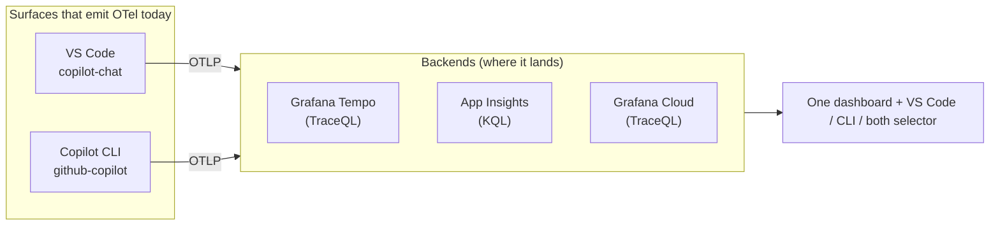

# You can't tune what you can't see: prompt‑cache observability for GitHub Copilot with OpenTelemetry (v2)


Open VS Code, ask Copilot Chat one question, and if you crack open the debug view you can watch
prompt‑cache tokens tick past for that single call. That's exactly enough visibility for one developer,
on one machine, for one prompt. It stops being enough the moment you want to answer a sharper question:

> **Is our Copilot usage actually *efficient* — and can I prove it across more than one editor?**

This is a hands‑on experiment that turns GitHub Copilot's OpenTelemetry signals into a dashboard you can
read at a glance — with **prompt‑cache hit rate** as the headline metric. It's honestly scoped to the
surfaces that **actually emit OpenTelemetry today** (VS Code and the Copilot CLI), and this v2 adds three
things people kept asking for: **exactly what you can monitor**, a **straight‑talking data‑privacy
section**, and a **"why would I bother"** for the individual developer.

---

## Why bother? What OTel gives *you*

Before the architecture, the motivation — because "set up observability" sounds like a chore until you
see what it answers.

**For you, the individual developer:**

- **Find out if caching is even working for you.** A high cache‑hit rate means Copilot is fast and
  cheap for your prompts. A low one means your prompt prefix keeps drifting — and now you can *see* it
  drop the moment it happens (after you reordered tools, changed a system message, or added a volatile
  workspace hint).
- **Stop guessing why Copilot "feels slow."** Time‑to‑first‑token and per‑model latency are right there.
  Is it the model? A specific tool? A giant context? You'll know.
- **Understand your own model mix and tool usage.** Which models you actually hit, which tools dominate,
  where the time goes.
- **Tune your prompts and custom instructions with a feedback loop.** Change something, watch the
  hit‑rate and latency respond. That's the difference between cargo‑culting prompt tips and *measuring*.

**For a team or platform group:**

- **A fleet view instead of anecdotes** — cache efficiency, cost, and adoption across developers and
  surfaces, sliced by model.
- **Catch regressions early** — a config or extension change that tanks caching shows up as a trend, not
  a support ticket.
- **Prove the investment** — accepted edits, lines of code, edit survival, PRs opened. Real outcome
  signals, not vanity counts.

The payoff‑to‑effort ratio is the hook: **`docker compose up -d`, four settings, five minutes** and you
have it locally, for $0, offline.

---

## Reality check: which Copilot surfaces even emit OpenTelemetry?

"Monitor all of Copilot" is a promise the platform doesn't fully keep *yet*. The honest map (mid‑2026):

| Surface | Export OTel to your backend? | `resource.service.name` | How |
|---------|------------------------------|-------------------------|-----|
| **VS Code Copilot Chat** | ✅ Yes | `copilot-chat` | `github.copilot.chat.otel.*` settings or `OTEL_*` env vars |
| **GitHub Copilot CLI** | ✅ Yes | `github-copilot` | `OTEL_*` env vars (`COPILOT_OTEL_ENABLED=true`) |
| **Copilot SDK** (Node/Py/Go/.NET/Java/Rust) | ✅ Yes — for apps you build | configurable | `TelemetryConfig` (drives the CLI process) |
| **Visual Studio** extension | ❌ Not today | — | — |
| **JetBrains** plugins | ❌ Not today | — | Rider's own OTel plugin instruments *your app*, not Copilot |
| **Copilot app** (desktop) | ✅ Yes — via the CLI | `github-copilot` | Frontend to the Copilot CLI: same `OTEL_*` env vars, reports as `github-copilot` (verified) |
| **Cloud coding agent** (opens PRs) | ❌ Not directly | — | server‑side; the *client* only emits session counters |

So this experiment covers **VS Code (`copilot-chat`)** and **the CLI (`github-copilot`)** — the two you
can actually collect from (the desktop **Copilot app** is a frontend to the CLI and reports as `github-copilot`
too) — plus the SDK for anything custom you build.

---

## The insight: two surfaces, one vocabulary

Both surfaces emit OpenTelemetry using the **GenAI semantic conventions**, so the important attributes are
identical — and they differ in exactly one thing, `resource.service.name`:

- **VS Code Copilot Chat** → `copilot-chat`
- **GitHub Copilot CLI** → `github-copilot`

That single difference becomes a **dashboard variable**, turning two data streams into one board with a
selector: *VS Code*, *Copilot CLI*, or *both*. Unifying editor and terminal telemetry isn't a data
project — it's a dropdown. Keep `OTEL_SERVICE_NAME` **unset** so each surface keeps its distinct name.

---

## What you can actually monitor

This is the part people underestimate. Copilot emits **traces, metrics, and events** — here's the real
inventory, and the question each piece answers.

### Traces — a span tree per interaction

```
invoke_agent copilot            ← the whole run
  ├── chat gpt-4o               ← one LLM call (cache tokens live here)
  ├── execute_tool readFile     ← one tool call
  └── chat gpt-4o
```

| Span | Key attributes | Answers |
|------|----------------|---------|
| **`invoke_agent`** | model, agent name/id, `conversation.id`, total input/output tokens, `cache_read`/`cache_creation` tokens, turn count, cost & "AI units" (CLI), duration, `error.type` | How expensive/long was the whole task? How many turns? |
| **`chat`** | requested/resolved model, per‑call tokens incl. **cache_read / cache_creation**, `finish_reasons`, time‑to‑first‑token, duration, `server.address` | Cache hit or miss? Which model? How fast? |
| **`execute_tool`** | `gen_ai.tool.name`, tool type (`function`/MCP), call id, edit type (`create`/`update`/`str_replace`), skill name, MCP server‑name **hash**, duration | Which tools run, how often, how slow, how often they fail |
| **`execute_hook`** (VS Code) | hook decision (`pass`/`block`), duration, scoped tools | Are policy hooks firing / blocking? |

### Metrics

- **`gen_ai.client.operation.duration`** — LLM call & agent duration (histogram)
- **`gen_ai.client.token.usage`** — token counts by type (input/output)
- **`time_to_first_token` / `time_to_first_chunk` / `time_per_output_chunk`** — responsiveness
- **tool call count & duration**, **agent turn count**, **session count**
- **Agentic *outcome* metrics** (VS Code, across surfaces) — the "is it paying off" data:
  edit **acceptance** (accept/reject), **lines of code** added/removed by accepted edits, **edit survival**
  (does AI code stick around, 4‑gram & no‑revert scores), **user actions** (copy/insert/apply/followup),
  **thumbs up/down feedback**, **pull requests created** (CLI), **cloud/remote agent sessions** and
  **PR‑ready** notifications.

### Events

Session lifecycle and interaction events: `session.start`, per‑tool `tool.call`, per‑turn `agent.turn`,
edit accept/reject and hunk actions, inline‑chat done, edit‑survival samples, user feedback, and cloud
session dispatch. The CLI adds span events for hook start/end/error, **context truncation/compaction**,
**skill invoked**, and **session shutdown** (with premium‑request count, lines added/removed, files
modified) and **abort**.

### Put differently — the questions you can now answer

- **Cache efficiency:** hit vs miss, per model, per surface, over time.
- **Cost & tokens:** input/output/cached tokens, cost, AI units.
- **Latency:** duration and time‑to‑first‑token by model.
- **Model mix:** which models, how often.
- **Tool usage & reliability:** top tools, latency, failures, MCP vs built‑in.
- **Agent shape:** agent vs single‑shot, turns per session, tools per run.
- **Adoption & outcomes:** edits accepted, lines shipped, edit survival, thumbs, PRs.
- **Reliability:** errors, stuck/aborted sessions, context compaction.

---

## The architecture: two surfaces × four backends



| Option | Runs locally | Backend | Cost |
|--------|--------------|---------|------|
| **A — Local** | Docker: Tempo + Grafana | Grafana Tempo (TraceQL) | $0 |
| **B — Azure, local collector** | Docker: Collector + Tempo + Grafana | Tempo **and** Application Insights | ~$0 |
| **C — Azure Container Apps** | Nothing | Application Insights (KQL) | ~$0 (scale‑to‑zero) |
| **D — Grafana Cloud** | Nothing | Grafana Cloud Tempo (TraceQL) | $0 (free tier) |

**A/D are "direct"** (editor/CLI → backend). **B/C put a collector in the path** — which, as you'll see
in the privacy section, is also your redaction control point.

---

## Turning it on: one env block covers both surfaces

VS Code — four **User** `settings.json` keys (must be User, not Workspace — the SDK inits too early):

```json
{
  "github.copilot.chat.otel.enabled": true,
  "github.copilot.chat.otel.exporterType": "otlp-http",
  "github.copilot.chat.otel.otlpEndpoint": "http://localhost:4318",
  "github.copilot.chat.otel.captureContent": false
}
```

> **📸 Screenshot placeholder:** _VS Code User `settings.json` with the four keys, then "Developer:
> Reload Window." (Save as `docs/images/vscode-settings.png`.)_

The Copilot **CLI reads the same `OTEL_*` env vars**, so for a cloud backend you set them once and *both*
surfaces report:

```powershell
setx OTEL_EXPORTER_OTLP_ENDPOINT "https://otlp-gateway-<zone>.grafana.net/otlp"
setx OTEL_EXPORTER_OTLP_HEADERS  "Authorization=Basic <base64>"
setx COPILOT_OTEL_ENABLED        "true"
# Do NOT set OTEL_SERVICE_NAME — keeps VS Code=copilot-chat, CLI=github-copilot for the selector.
```

Env vars only reach *newly launched* processes: open a **fresh** terminal, `echo` to confirm, then run
`copilot`.

---

## What you see


*The `All (VS Code + CLI)` view — cache hit/miss, calls by surface, models, tools, and a trace table.*

The **Copilot surface** selector maps to one filter that means the same thing on either backend:

- **TraceQL:** `{ resource.service.name =~ "$surface" } | count_over_time() by (resource.service.name)`
- **KQL:** `dependencies | where cloud_RoleName matches regex '$surface' | summarize count() by cloud_RoleName`


*Flip it to one surface and the whole board re‑scopes — no second dashboard.*

---

## Why prompt‑cache hit rate is *the* number

- **Leading indicator of prompt stability** — a falling hit rate means a prefix drifted before anyone
  files a "Copilot feels slow" ticket.
- **Directly tied to cost and latency** — cache reads are cheaper and faster than rebuilding a prefix.
- **Turns a feeling into an argument** — "the CLI's hit rate on `claude-sonnet-4.6` dropped 30% after
  Tuesday's change; which prompt shape did we destabilize?" has an answer.

---

## Data privacy: what leaves your machine (and where it goes)

This is the question that decides whether you can actually roll this out. The short version is reassuring;
the details matter.

### 1. OTLP export goes to *your* endpoint — not to GitHub

Enabling OpenTelemetry export **does not send more data to GitHub or Microsoft.** It routes telemetry to
the OTLP endpoint *you* configure — your local Tempo, your Application Insights, your Grafana Cloud stack.
(Copilot's normal product telemetry to GitHub is a separate thing, governed by your GitHub/enterprise
settings and Trust Center — unchanged by any of this.) So the real question is simply: *what does **my**
backend receive?*

### 2. By default, no prompts, no code, no responses

Content capture is **off by default** — a deliberate choice in the OpenTelemetry GenAI conventions,
because model inputs routinely contain PII and confidential code (GDPR/HIPAA territory). With the default:

- **Not sent:** prompt text, model responses, system prompts, tool arguments/results, tool schemas,
  file paths, shell command strings.
- **Sent (metadata only):** operation type, model name, **token counts** (incl. cache), durations/TTFT,
  finish reasons, tool **names**, error types, opaque session/conversation IDs.

### 3. The metadata that *is* sent — know these two

Even with content off, a couple of attributes are identifying and worth a conscious decision:

- **VS Code** attaches repository context by default: `github.copilot.git.repository` (remote URL),
  `git.branch`, `git.commit_sha`, and `github.copilot.github.org`. Not your code — but it reveals *which
  project* and *which org*. Relevant if you ever run Copilot in a customer or internal repo.
- **The CLI** attaches `enduser.pseudo.id` — a **pseudonymous** user identifier (not your name/email).
- Nice touch: MCP **server names are already SHA‑256 hashed** in tool spans.

### 4. Turning content capture on — do it deliberately

Flip `captureContent` (VS Code) or `OTEL_INSTRUMENTATION_GENAI_CAPTURE_MESSAGE_CONTENT=true` (CLI) and the
traces gain full prompts, responses, system prompts, tool schemas, and tool args/results. That's powerful
for debugging *your own* prompts and a liability for anyone else's. Only enable it against a **trusted,
access‑controlled backend you own**, never a shared SaaS.

### 5. Where the data physically lives (residency)

- **A — Local:** never leaves your laptop.
- **B / C — Application Insights:** your Azure region (pick an EEA region like Sweden Central / Norway
  East for EU residency), under your Azure RBAC.
- **D — Grafana Cloud:** Grafana Labs' SaaS, in the region of your stack (a third party).

### 6. The collector is your redaction control point

Direct paths (A local, D Grafana Cloud) send whatever the client emits — there's nothing in between. The
**collector paths (B, C)** let you scrub before anything leaves. In the OTel Collector you can drop or
hash attributes:

```yaml
processors:
  attributes/redact:
    actions:
      - key: github.copilot.git.repository   # drop repo URL
        action: delete
      - key: github.copilot.github.org       # drop org
        action: delete
      - key: enduser.pseudo.id               # or hash instead of delete
        action: hash
```

Add it to the traces pipeline and the git/org identifiers never reach your backend. (The
`redaction` and `transform`/OTTL processors give you regex‑based masking if you go further.)

### Practical privacy checklist

- ✅ Keep `captureContent` **off** unless you own the backend and control access.
- ✅ Prefer a **collector path (B/C)** for teams so you can **redact** `github.copilot.git.*` / org and
  hash user ids.
- ✅ Choose an **EEA Azure region** if residency matters; know that **D sends to a third‑party SaaS**.
- ✅ Treat the **OTLP endpoint token as a secret** (env var, not committed; rotate if leaked).
- ✅ Remember OTLP export is **additive to your own stack**, not extra data to GitHub.
- ✅ For fleets, push config via **Intune** pointed at a **central collector that redacts** — so policy is
  enforced, not per‑developer trust.

---

## From laptop to fleet

1. **Prove it locally (A):** `docker compose up -d`, paste the settings, use Copilot, open `:3001`.
2. **Add a backend (B/C/D)** for persistence and an org‑wide view.
3. **Enforce with Intune:** push the settings / `OTEL_*` env vars to managed devices, pointed at a shared
   (redacting) collector. Telemetry stops being opt‑in; both surfaces report automatically.

When another surface adopts the same conventions — a JetBrains plugin or Visual Studio — it
slots into the selector: a new `service.name`, a new option. Until then, the dashboard shows exactly
what's instrumented, and no more. That honesty is a feature.

---

## The takeaway

Observability for AI‑assisted coding isn't a new discipline — it's the same OpenTelemetry story we've told
for services, aimed at a new audience. Two observations do the heavy lifting: VS Code and the Copilot CLI
already speak the same GenAI vocabulary, and the one attribute separating them is the one you turn into a
dropdown. Everything else is counting cache hits — safely, on your own terms, with prompts and code
staying exactly where you decide.

**Try it:** the full experiment (Docker Compose for local, Azure and Grafana Cloud setups, both
surface‑aware dashboards, and the redaction snippet above) is on GitHub — clone it, `docker compose up -d`,
and you'll have VS Code and the CLI on one board in about five minutes.

> 👉 **[webmaxru/copilot-otel-grafana](https://github.com/webmaxru/copilot-otel-grafana)**

---

### Appendix: pick a backend

| Pick this when… | Option |
|-----------------|--------|
| Solo, offline, or just kicking the tires | **A — Local** |
| You want *both* the local TraceQL board and the Azure one, with a collector to redact | **B — Azure, local collector** |
| Azure org, nothing local, data stays in your region, fleet‑ready, ~$0 idle | **C — Azure Container Apps** |
| Nothing to run, fastest path to a hosted dashboard | **D — Grafana Cloud** |

*Local Grafana screenshots were captured against Grafana Tempo with demo traces from both surfaces.
Azure‑portal, Grafana Cloud, and VS Code settings views are marked as placeholders — drop in your own.*
