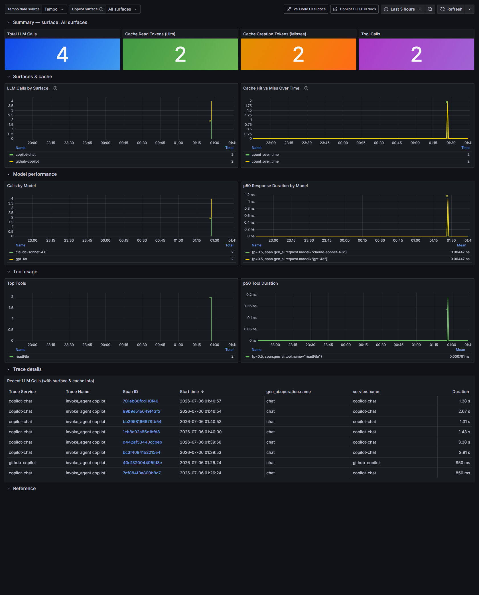
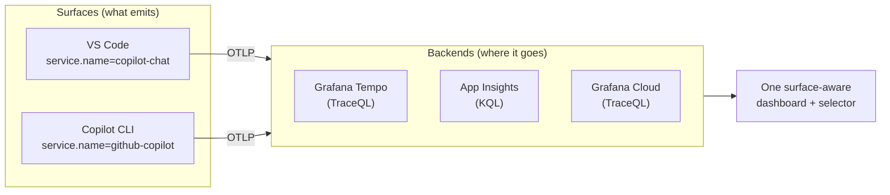
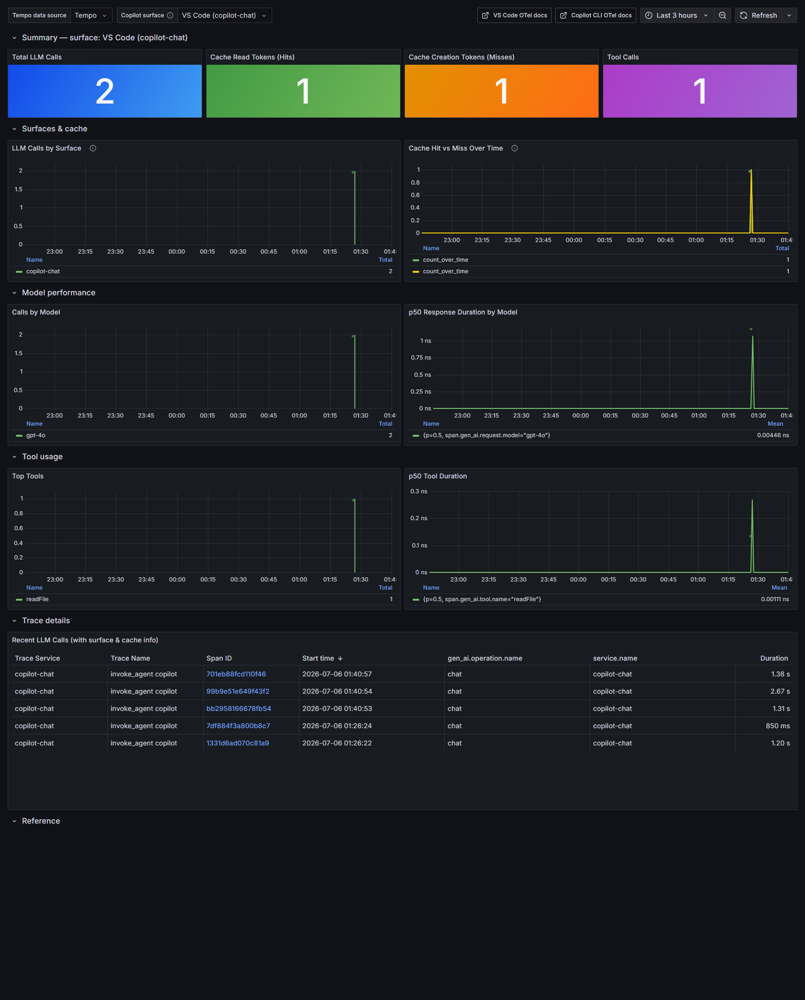
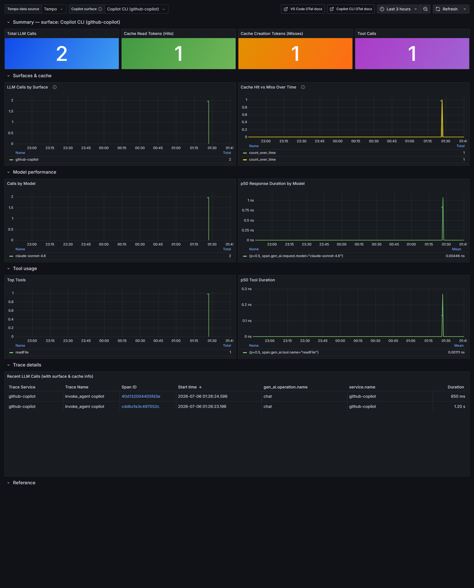

# You can't tune what you can't see: OpenTelemetry for *every* GitHub Copilot surface

Open VS Code, ask Copilot Chat one question, and if you crack open the debug view you can watch
prompt‑cache tokens tick past for that single call. That's exactly enough visibility for one
developer on one machine. It stops being enough the moment two things happen: a platform team wants
the same picture across a fleet, and your developers stop living only in the editor.

Because that second thing has already happened. Copilot isn't just a chat panel anymore — it's a
**CLI**, an agent, a set of surfaces that each do real work. The good news is they've started
speaking a common language: **OpenTelemetry**. The question this experiment answers is simple to ask
and, until recently, annoying to answer:

> Can I watch **all** of GitHub Copilot — VS Code *and* the CLI — on **one** dashboard, and tell the
> surfaces apart when I want to?

Yes. And it costs $0 to start. Here's the story of how, what it looks like, and why prompt‑cache
efficiency is the number worth watching.


*One dashboard, a "Copilot surface" selector, both surfaces side by side. This is the local Grafana
running against Grafana Tempo — no cloud account required.*

---

## The problem: adoption is easy, *efficiency* is invisible

Most orgs are past the "should we adopt Copilot" question. Adoption is healthy. The harder questions
come next, and they're all about behavior you can't see from a usage dashboard:

- **How stable are the prompts our developers actually send?** Copilot leans hard on **prompt
  caching** — reusing a cached prompt prefix instead of rebuilding it. A cache **hit** is faster,
  cheaper, and more predictable. A **miss** means the prefix drifted: a slightly different system
  message, an unstable ordering of tools, a workspace hint that changes on every call. Drift quietly
  torches your hit rate, and nobody notices until responses feel slow and erratic.
- **Which surface is doing what?** A developer might run a quick chat in VS Code and a long agent
  task in the CLI five minutes later. Those are different cost and latency profiles. If your
  telemetry blends them into one undifferentiated blob — or worse, only captures one surface — you're
  flying half‑blind.

The per‑developer debug view answers none of this. It doesn't aggregate, it doesn't persist, and it
only knows about the editor. **You can't tune what you can't see.**

---

## The insight: two surfaces, one vocabulary

Here's the unlock. Recent VS Code and the GitHub Copilot CLI both emit OpenTelemetry using the
**GenAI semantic conventions**. That means the attributes that matter are *identical* across surfaces:

| Attribute | Meaning |
|-----------|---------|
| `gen_ai.usage.cache_read.input_tokens` | Tokens served **from** cache → a **hit** |
| `gen_ai.usage.cache_creation.input_tokens` | Tokens **written to** cache → a **miss** |
| `gen_ai.usage.input_tokens` / `output_tokens` | Raw token counts |
| `gen_ai.request.model` | Which model |
| `gen_ai.operation.name` | `chat`, `invoke_agent`, or `execute_tool` |

**Cache hit** = `cache_read.input_tokens > 0`. **Cache miss** = `cache_creation.input_tokens > 0`.
Both zero = no cache involvement. Nail down those three states and everything else on a dashboard is
just counting.

So what's different between VS Code and the CLI? Exactly one thing: the resource attribute
`service.name`.

- **VS Code Copilot Chat** → `service.name = copilot-chat`
- **GitHub Copilot CLI** → `service.name = github-copilot`

That single difference is the whole game. If the *only* thing that distinguishes the surfaces is one
attribute, then a **dashboard variable that filters on that attribute** turns two separate data
streams into one dashboard with a **surface selector**: *All surfaces*, *VS Code*, or *Copilot CLI*.

That's the reversal at the heart of this experiment. The "hard" problem of unifying multiple Copilot
surfaces isn't a data‑integration project. It's a dropdown.

---

## The architecture: surfaces × backends

The experiment is organized around two independent choices.



**Surfaces** are *what* emits telemetry. **Backends** are *where* it lands — and there are four,
deliberately spanning "runs on my laptop, offline, free" to "fleet‑ready, nothing local":

| Option | Runs locally | Backend | Cost |
|--------|--------------|---------|------|
| **A — Local** | Docker: Tempo + Grafana | Grafana Tempo (TraceQL) | $0 |
| **B — Azure, local collector** | Docker: Collector + Tempo + Grafana | Tempo **and** Application Insights | ~$0 |
| **C — Azure Container Apps** | Nothing | Application Insights (KQL) | ~$0 (scale‑to‑zero) |
| **D — Grafana Cloud** | Nothing | Grafana Cloud Tempo (TraceQL) | $0 (free tier) |

The nice property: **the surface selector works on every backend.** Whether you're reading TraceQL in
Tempo or KQL in Application Insights, the query is "filter on the surface, then count."

A word on the two shapes you'll see:

- **A and D are "direct":** the editor/CLI sends OTLP straight to Tempo or Grafana Cloud. Simple,
  minimal, perfect for one machine.
- **B and C put a collector in the path.** That's not ceremony — a collector gives you **redaction**
  (strip attributes before they leave), **fan‑out** (B sends to Tempo *and* App Insights at once),
  and **buffering** (a brief backend outage doesn't drop spans). It's the difference between a demo
  and something you'd run for a team.

None of the four needs a paid Grafana instance. B and C view the official Grafana‑powered dashboards
*inside the Azure portal* for free; D uses Grafana Cloud's free tier.

---

## Turning it on: one env block lights up every surface

Enabling VS Code is four settings in your **User** `settings.json` (it must be User, not Workspace —
the OTel SDK initializes too early in startup for workspace settings to be picked up):

```json
{
  "github.copilot.chat.otel.enabled": true,
  "github.copilot.chat.otel.exporterType": "otlp-http",
  "github.copilot.chat.otel.otlpEndpoint": "http://localhost:4318",
  "github.copilot.chat.otel.captureContent": false
}
```

> **📸 Screenshot placeholder:** _VS Code User `settings.json` with the four
> `github.copilot.chat.otel.*` keys, then "Developer: Reload Window." (Capture from a local VS Code
> session; save as `docs/images/vscode-settings.png`.)_

Now the part that makes "all surfaces" almost free: **the Copilot CLI reads the same standard
`OTEL_*` environment variables.** So for a cloud backend, you set the endpoint and an auth header
once, at the user level, and *both* surfaces report:

```powershell
setx OTEL_EXPORTER_OTLP_ENDPOINT "https://otlp-gateway-<zone>.grafana.net/otlp"
setx OTEL_EXPORTER_OTLP_HEADERS  "Authorization=Basic <base64>"
setx COPILOT_OTEL_ENABLED        "true"
# Deliberately DO NOT set OTEL_SERVICE_NAME.
```

That last line is the subtle, important one. The CLI defaults `OTEL_SERVICE_NAME` to `github-copilot`
and VS Code defaults to `copilot-chat`. **Leave it unset** and the two surfaces keep their distinct
identities — which is exactly what the selector needs. Set it globally and you'd collapse them into
one. The most powerful configuration here is the one where you *don't* touch a knob.

One gotcha worth saving you an hour: environment variables only reach *newly launched* processes.
Open a **fresh** terminal (or reboot), confirm with `echo $env:OTEL_EXPORTER_OTLP_ENDPOINT`, then run
`copilot`. Inside VS Code, its integrated terminal inherits the same variables — a handy way to
confirm the editor picked them up.

---

## What you actually see

The dashboard ships as an uploadable JSON with a **Copilot surface** template variable. Behind the
scenes it's a one‑line filter that changes shape per backend but means the same thing:

- **TraceQL (Tempo / Grafana Cloud):** `{ resource.service.name =~ "$surface" } | count_over_time() by (resource.service.name)`
- **KQL (Application Insights):** `dependencies | where cloud_RoleName matches regex '$surface' | summarize count() by cloud_RoleName`

Where `$surface` is `copilot-chat|github-copilot` for *All*, or a single value for one surface. The
**"LLM Calls by Surface"** panel in the screenshot above is that `by (resource.service.name)` group —
VS Code and the CLI, stacked, from one query.

Flip the selector to a single surface and the entire board re‑scopes:


*Same dashboard, "Copilot surface" set to VS Code (`copilot-chat`).*


*And set to Copilot CLI (`github-copilot`). Same panels, different surface — no second dashboard.*

Around the cache panels you get the usual, useful suspects: calls and p50 latency by model, top
tools, tokens in/out, and a raw trace table with `service.name` right there in a column so you can
eyeball which surface produced each span.

For the Azure side, the same idea renders in **Azure Monitor → Dashboards with Grafana** — the free,
in‑portal Grafana — reading Application Insights with KQL. (This also quietly fixes a real gap: the
official Azure "GitHub Copilot" gallery dashboard filters on `copilot-chat` only, so it can't see the
CLI at all. The surface‑aware version does.)

> **📸 Screenshot placeholder:** _Azure Monitor → "Dashboards with Grafana" showing the App
> Insights / KQL version of this dashboard with the surface selector. (Requires the Azure portal;
> save as `docs/images/azure-dashboards-with-grafana.png`.)_

> **📸 Screenshot placeholder:** _Grafana Cloud → Explore, running
> `{ resource.service.name =~ "copilot-chat|github-copilot" }` against managed Tempo. (Requires a
> Grafana Cloud login; save as `docs/images/grafana-cloud-explore.png`.)_

---

## The privacy dial (because someone always asks in the first minute)

By default, **no prompt content, responses, or tool arguments are captured** — only metadata like
model names, token counts, and durations. Flip `captureContent` on (VS Code) or
`OTEL_INSTRUMENTATION_GENAI_CAPTURE_MESSAGE_CONTENT=true` (CLI) and the traces suddenly include full
prompts, responses, and code. That's fantastic for debugging your own prompts and terrifying for
anyone else's, so the safe default stays off.

This is the other reason the collector options (B, C) matter for a team: going **direct** to a cloud
backend means there's nothing in the path to scrub attributes before they leave. A collector can
redact. For a demo on your laptop, direct is fine. For a fleet, put a collector in front.

---

## Why prompt‑cache efficiency is the number to watch

It's tempting to treat all this as generic "AI usage" telemetry. The sharper lens is **cache hit
rate per surface, per model, over time.** Here's why it earns its place on the wall:

- It's a **leading indicator of prompt stability.** A falling hit rate means something upstream is
  drifting — a system‑message change, a tool‑ordering regression, an unstable workspace hint. You
  catch prompt‑shape problems before they show up as "Copilot feels slow."
- It's **directly tied to cost and latency.** Cache reads are cheaper and faster than rebuilding a
  prefix. Efficiency here is money and milliseconds.
- It **turns a vague feeling into an argument you can act on.** "Something feels inconsistent from run
  to run" becomes "the CLI's hit rate on `claude-sonnet-4.6` dropped 30% after Tuesday's change —
  which prompt shape did we destabilize?" That's a much better question to be fighting about, because
  you can actually answer it.

---

## From laptop to fleet

The path scales without changing the mental model:

1. **Prove it locally (Option A).** `docker compose up -d`, paste the settings, use Copilot for five
   minutes, open `http://localhost:3001`. No cloud, no signup.
2. **Add a backend (B/C/D)** when you want persistence and an org‑wide view — Application Insights in
   your Azure region, or Grafana Cloud's free tier.
3. **Enforce it with Intune.** The four VS Code settings and the `OTEL_*` env vars are exactly the
   kind of thing you push as **managed settings**. Point the managed endpoint at a shared collector or
   SaaS endpoint, and telemetry stops being opt‑in. Every developer, every surface, reporting
   automatically.

And when the *next* Copilot surface starts emitting OTel — a JetBrains plugin, Visual Studio, an
agent runner — it slots straight in: a new `service.name`, a new option in the selector. Nothing else
changes.

---

## The takeaway

Observability for AI‑assisted coding isn't a new discipline. It's the same OpenTelemetry story we've
been telling for services, aimed at a slightly different audience — and now at a slightly larger
target, because "Copilot" means more than one surface. The trick isn't heavy machinery. It's noticing
that VS Code and the CLI already speak the same GenAI vocabulary, and that the one attribute
separating them is the one you turn into a dropdown.

Once you can *see* the traces — per surface, per model, per prompt shape — the downstream conversations
about tuning and cost stop being hand‑wavy. That's the whole point.

**Try it:** the full experiment (Docker Compose for local, Azure and Grafana Cloud setups, both
surface‑aware dashboards) is on GitHub — clone it, `docker compose up -d`, and you'll have both
surfaces on one board in about five minutes.

> 👉 **[webmaxru/copilot-otel-grafana](https://github.com/webmaxru/copilot-otel-grafana)**

---

### Appendix: the four backends at a glance

| Pick this when… | Option |
|-----------------|--------|
| Solo, offline, or just kicking the tires | **A — Local** |
| You want *both* the local TraceQL board and the Azure one, with a collector | **B — Azure, local collector** |
| Azure org, nothing local, data stays in Azure, fleet‑ready, ~$0 idle | **C — Azure Container Apps** |
| Nothing to run, fastest path to a hosted dashboard | **D — Grafana Cloud** |

*Screenshots of the local Grafana were captured against Grafana Tempo with a handful of demo traces
across both surfaces. Azure‑portal and Grafana Cloud views are marked as placeholders above — drop in
your own once your backend is live.*
