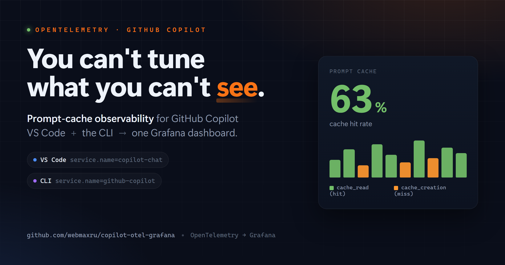
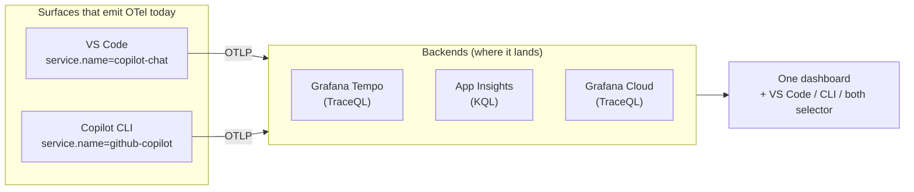

# You can't tune what you can't see: prompt‑cache observability for GitHub Copilot with OpenTelemetry



Open VS Code, ask Copilot Chat one question, and if you crack open the debug view you can watch
prompt‑cache tokens tick past for that single call. That's exactly enough visibility for one developer,
on one machine, for one prompt. It stops being enough the moment you want to answer a sharper question:

> **Is our Copilot usage actually *efficient* — and can I prove it across more than one editor?**

This is a hands‑on experiment that turns GitHub Copilot's OpenTelemetry signals into a dashboard you
can read at a glance — with **prompt‑cache hit rate** as the headline metric. It's deliberately honest
about scope: it covers the Copilot surfaces that **actually emit OpenTelemetry today** (VS Code and the
Copilot CLI), and it's clear about the ones that don't yet. No hand‑waving, no "coming soon" as if it
were shipping.


*One dashboard, one selector — VS Code, the CLI, or both — running on local Grafana against Grafana
Tempo. No cloud account required.*

---

## The problem: adoption is easy, *efficiency* is invisible

Most teams are past "should we adopt Copilot." Adoption is healthy. The harder question is whether the
prompts your developers send are **stable and reusable** — because that's what prompt caching rewards.

Copilot leans hard on **prompt caching**: reusing a cached prompt *prefix* instead of rebuilding it. A
cache **hit** is faster, cheaper, and more predictable. A **miss** means the prefix drifted — a slightly
different system message, an unstable ordering of tools, a workspace hint that changes on every call.
Drift quietly torches your hit rate, and nobody notices until responses feel slow and erratic.

The per‑developer debug view can't answer this. It doesn't aggregate across people, it doesn't persist
over a week, and it can't slice by model or by prompt shape. **You can't tune what you can't see.**

---

## Reality check: which Copilot surfaces even emit OpenTelemetry?

Before designing a dashboard, it's worth being precise about what's actually instrumented — because
"monitor all of Copilot" is a promise the platform doesn't fully keep *yet*. Here's the real coverage
map (mid‑2026):

| Surface | Can you export its OTel to your own backend? | How |
|---------|----------------------------------------------|-----|
| **VS Code Copilot Chat** | ✅ **Yes** | `github.copilot.chat.otel.*` settings or `OTEL_*` env vars |
| **GitHub Copilot CLI** | ✅ **Yes** | `OTEL_*` env vars (`COPILOT_OTEL_ENABLED=true`) |
| **Copilot SDK** (Node/Py/Go/.NET/Java/Rust) | ✅ **Yes** — for apps you build | `TelemetryConfig` (drives the CLI process) |
| **Visual Studio** extension | ❌ Not today | — |
| **JetBrains** plugins | ❌ Not today | — |
| **Copilot app** (desktop) | ⚠️ Not documented | (agent‑native; likely shares the CLI core) |
| **Cloud coding agent** (opens PRs) | ❌ Not directly | server‑side; the *client* only records session counters |

Two clarifications that save you a rabbit hole:

- **JetBrains has an "OpenTelemetry" feature — but it's the wrong one.** JetBrains Rider ships an OTel
  plugin that instruments *your application's* traces. It does **not** export Copilot's `gen_ai.*`
  telemetry. Same words, different thing.
- **The cloud coding agent runs on GitHub's servers**, so you can't point it at your OTLP endpoint. What
  you *can* see is client‑side: VS Code/CLI emit counters like `copilot_chat.cloud.session.count` and
  `copilot_chat.cloud.pr_ready.count` when they dispatch remote work. You observe that a cloud session
  happened, not its internal spans.

So this experiment is honestly scoped to the two surfaces that speak OTLP to *your* collector today —
**VS Code and the Copilot CLI** — plus the SDK for anything custom you build. That's not a limitation of
the approach; it's the current shape of the platform, and the design slots new surfaces in the moment
they adopt the same conventions.

---

## The insight: two surfaces, one vocabulary

Here's the unlock. Recent VS Code and the Copilot CLI both emit OpenTelemetry using the **GenAI semantic
conventions**, so the attributes that matter are *identical* across them:

| Attribute | Meaning |
|-----------|---------|
| `gen_ai.usage.cache_read.input_tokens` | Tokens served **from** cache → a **hit** |
| `gen_ai.usage.cache_creation.input_tokens` | Tokens **written to** cache → a **miss** |
| `gen_ai.usage.input_tokens` / `output_tokens` | Raw token counts |
| `gen_ai.request.model` | Which model |
| `gen_ai.operation.name` | `chat`, `invoke_agent`, or `execute_tool` |

**Cache hit** = `cache_read.input_tokens > 0`. **Cache miss** = `cache_creation.input_tokens > 0`. Both
zero = no cache involvement. Nail those three states and everything else on the dashboard is counting.

What's different between the two surfaces? Exactly one thing — the resource attribute `service.name`:

- **VS Code Copilot Chat** → `service.name = copilot-chat`
- **GitHub Copilot CLI** → `service.name = github-copilot`

That single difference is the whole trick. If the *only* thing separating the surfaces is one attribute,
then a **dashboard variable that filters on it** turns two data streams into one board with a selector:
*VS Code*, *Copilot CLI*, or *both*. The "hard" part of unifying editor and terminal telemetry isn't a
data‑integration project — it's a dropdown.

---

## The architecture: two surfaces × four backends



The backends span "runs on my laptop, offline, free" to "fleet‑ready, nothing local":

| Option | Runs locally | Backend | Cost |
|--------|--------------|---------|------|
| **A — Local** | Docker: Tempo + Grafana | Grafana Tempo (TraceQL) | $0 |
| **B — Azure, local collector** | Docker: Collector + Tempo + Grafana | Tempo **and** Application Insights | ~$0 |
| **C — Azure Container Apps** | Nothing | Application Insights (KQL) | ~$0 (scale‑to‑zero) |
| **D — Grafana Cloud** | Nothing | Grafana Cloud Tempo (TraceQL) | $0 (free tier) |

A word on the two shapes you'll see: **A and D are "direct"** (the editor/CLI sends OTLP straight to
Tempo or Grafana Cloud — minimal, perfect for one machine), while **B and C put a collector in the
path**, which buys you redaction, fan‑out to multiple backends, and buffering. None of the four needs a
paid Grafana instance.

---

## Turning it on: one env block covers both surfaces

VS Code is four **User** `settings.json` keys (it must be User, not Workspace — the OTel SDK initializes
too early in startup for workspace settings to be picked up):

```json
{
  "github.copilot.chat.otel.enabled": true,
  "github.copilot.chat.otel.exporterType": "otlp-http",
  "github.copilot.chat.otel.otlpEndpoint": "http://localhost:4318",
  "github.copilot.chat.otel.captureContent": false
}
```

> **📸 Screenshot placeholder:** _VS Code User `settings.json` with the four
> `github.copilot.chat.otel.*` keys, then "Developer: Reload Window." (Capture from a local VS Code
> session; save as `docs/images/vscode-settings.png`.)_

The Copilot **CLI reads the same standard `OTEL_*` environment variables**, so for a cloud backend you
set the endpoint and auth once, at the user level, and *both* surfaces report:

```powershell
setx OTEL_EXPORTER_OTLP_ENDPOINT "https://otlp-gateway-<zone>.grafana.net/otlp"
setx OTEL_EXPORTER_OTLP_HEADERS  "Authorization=Basic <base64>"
setx COPILOT_OTEL_ENABLED        "true"
# Deliberately DO NOT set OTEL_SERVICE_NAME.
```

That last line is the subtle one. The CLI defaults `OTEL_SERVICE_NAME` to `github-copilot` and VS Code
to `copilot-chat`. **Leave it unset** and the two surfaces keep distinct identities — exactly what the
selector needs. Set it globally and you'd collapse them into one. The most powerful configuration here
is the knob you *don't* turn. (Building a custom Copilot‑powered app? The **Copilot SDK** exposes the same
telemetry via `TelemetryConfig` — it configures the CLI process it drives, so your app's data lands the
same way.)

One gotcha worth an hour of your life: environment variables only reach *newly launched* processes. Open
a **fresh** terminal (or reboot), confirm with `echo $env:OTEL_EXPORTER_OTLP_ENDPOINT`, then run
`copilot`.

---

## What you actually see

The dashboard ships as an uploadable JSON with a **Copilot surface** selector. Behind it is a one‑line
filter that means the same thing on either backend:

- **TraceQL (Tempo / Grafana Cloud):** `{ resource.service.name =~ "$surface" } | count_over_time() by (resource.service.name)`
- **KQL (Application Insights):** `dependencies | where cloud_RoleName matches regex '$surface' | summarize count() by cloud_RoleName`

Where `$surface` is `copilot-chat|github-copilot` for *both*, or a single value for one. The **"LLM Calls
by Surface"** panel in the screenshot above is that group — VS Code and the CLI, stacked, from one query.

Flip the selector and the whole board re‑scopes to one surface:


*Same board, filtered to VS Code (`copilot-chat`).*


*And to the Copilot CLI (`github-copilot`) — same panels, different surface, no second dashboard.*

Around the cache panels: calls and p50 latency by model, top tools, tokens in/out, and a raw trace table
with `service.name` in a column so you can eyeball which surface produced each span. The Azure side renders
the same idea in **Azure Monitor → Dashboards with Grafana** (free, in‑portal, KQL) — which also fixes a
real gap: the official Azure "GitHub Copilot" gallery dashboard filters on `copilot-chat` only, so it
can't see the CLI at all. The surface‑aware version does.

> **📸 Screenshot placeholder:** _Azure Monitor → "Dashboards with Grafana" showing the App Insights / KQL
> board with the surface selector. (Requires the Azure portal; save as
> `docs/images/azure-dashboards-with-grafana.png`.)_

> **📸 Screenshot placeholder:** _Grafana Cloud → Explore running
> `{ resource.service.name =~ "copilot-chat|github-copilot" }` against managed Tempo. (Requires a Grafana
> Cloud login; save as `docs/images/grafana-cloud-explore.png`.)_

---

## Why prompt‑cache hit rate is the number to watch

It's tempting to treat this as generic "AI usage" telemetry. The sharper lens is **cache hit rate — per
surface, per model, over time** — because:

- It's a **leading indicator of prompt stability.** A falling hit rate means something upstream drifted
  (a system‑message change, a tool‑ordering regression, an unstable workspace hint). You catch
  prompt‑shape problems before they surface as "Copilot feels slow."
- It's **directly tied to cost and latency.** Cache reads are cheaper and faster than rebuilding a prefix.
- It **turns a feeling into an argument you can act on.** "Something feels inconsistent" becomes "the
  CLI's hit rate on `claude-sonnet-4.6` dropped 30% after Tuesday's change — which prompt shape did we
  destabilize?" That's a much better question, because it has an answer.

---

## The privacy dial (someone always asks in the first minute)

By default, **no prompt content, responses, or tool arguments are captured** — only metadata like model
names, token counts, and durations. Flip `captureContent` on (VS Code) or
`OTEL_INSTRUMENTATION_GENAI_CAPTURE_MESSAGE_CONTENT=true` (CLI) and traces suddenly include full prompts,
responses, and code — fantastic for debugging your own, terrifying for anyone else's. The safe default
stays off. This is also why the collector backends (B, C) matter for a team: going **direct** to a cloud
backend means nothing in the path can scrub attributes; a collector can redact before data leaves.

---

## From laptop to fleet

The path scales without changing the mental model:

1. **Prove it locally (Option A).** `docker compose up -d`, paste the settings, use Copilot for five
   minutes, open `http://localhost:3001`. No cloud, no signup.
2. **Add a backend (B/C/D)** for persistence and an org‑wide view — App Insights in your Azure region, or
   Grafana Cloud's free tier.
3. **Enforce it with Intune.** The VS Code settings and `OTEL_*` env vars are exactly the kind of thing you
   push as **managed settings**, pointed at a shared collector or SaaS endpoint. Telemetry stops being
   opt‑in — every managed developer, both surfaces, reporting automatically.

And the honest roadmap: **when the next surface adopts these conventions** — a JetBrains plugin, Visual
Studio, the Copilot app — it slots straight into the selector: a new `service.name`, a new option, nothing
else. Until then, the dashboard shows you exactly what's instrumented, and no more. That honesty is a
feature: you know precisely what your numbers do and don't cover.

---

## The takeaway

Observability for AI‑assisted coding isn't a new discipline — it's the same OpenTelemetry story we've told
for services, aimed at a new audience. The trick here isn't heavy machinery. It's two observations:
VS Code and the Copilot CLI already speak the same GenAI vocabulary, and the one attribute separating them
is the one you turn into a dropdown. Everything else is counting cache hits.

Once you can *see* the traces — per surface, per model, per prompt shape — the downstream conversations
about prompt tuning and cost stop being hand‑wavy. That's the whole point.

**Try it:** the full experiment (Docker Compose for local, Azure and Grafana Cloud setups, both
surface‑aware dashboards) is on GitHub — clone it, `docker compose up -d`, and you'll have VS Code and the
CLI on one board in about five minutes.

> 👉 **[webmaxru/copilot-otel-grafana](https://github.com/webmaxru/copilot-otel-grafana)**

---

### Appendix: pick a backend

| Pick this when… | Option |
|-----------------|--------|
| Solo, offline, or just kicking the tires | **A — Local** |
| You want *both* the local TraceQL board and the Azure one, with a collector | **B — Azure, local collector** |
| Azure org, nothing local, data stays in Azure, fleet‑ready, ~$0 idle | **C — Azure Container Apps** |
| Nothing to run, fastest path to a hosted dashboard | **D — Grafana Cloud** |

*Local Grafana screenshots were captured against Grafana Tempo with a handful of demo traces from both
surfaces. Azure‑portal and Grafana Cloud views are marked as placeholders above — drop in your own once
your backend is live.*
